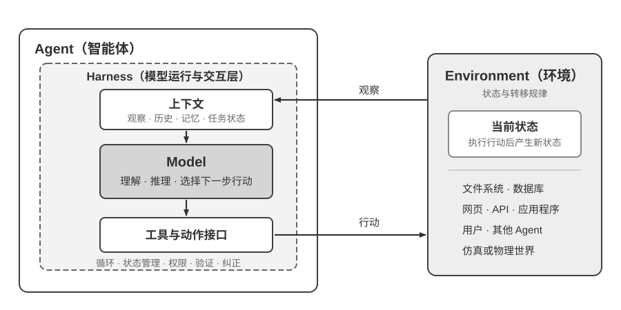

<!-- 自动生成；个人补充请写入 personal/。 -->

[全书目录](../../../README.md) · [上级目录](../README.md) · [上一篇：AI Agent 入门](../README.md) · [下一篇：观察空间与动作空间：模型与世界的接口](01-%E8%A7%82%E5%AF%9F%E7%A9%BA%E9%97%B4%E4%B8%8E%E5%8A%A8%E4%BD%9C%E7%A9%BA%E9%97%B4%EF%BC%9A%E6%A8%A1%E5%9E%8B%E4%B8%8E%E4%B8%96%E7%95%8C%E7%9A%84%E6%8E%A5%E5%8F%A3.md)

> 所属章节：[第1章：AI Agent 入门](../README.md)
>
> 来源：[原文及行号](https://github.com/bojieli/ai-agent-book/blob/d1502f59c1a8c40b4d1c51c250238cd9dd836f1b/book/chapter1.md#L11-L36) · [在线原书](https://bojieli.github.io/ai-agent-book/book/chapter1/)

<!-- 原文开始 -->

## 现代 Agent = LLM + 上下文 + 工具

现代 Agent 的最小工程实现可以用一个简洁的公式来表达：**Agent = LLM（大语言模型，Large Language Model）+ 上下文 + 工具**。这里的加号表示工程组件的组合，而不是强化学习中的形式化定义；更重要的是，这个公式只描述 Agent 边界之内的实现，**不包含 Agent 与之交互的 Environment（环境）**。其中每个词都需要做广义但边界清楚的理解：

- **LLM 是 Agent 的大脑**：它不只是一组模型参数，而是 Agent 的整个决策内核——理解意图、思考规划、做出判断。就像人类大脑不只是神经元的集合，还包括通过经验塑造的思维方式，LLM 的能力也来自两部分：**预训练**所积累的世界知识与语言能力，以及**后训练**所固化的决策策略——后者的具体技术（如监督微调与强化学习）将在第八章展开。
- **上下文是 Agent 的眼睛**：它不只是输入给模型的那段文本，而是 Agent 在每个决策点收到并保留的信息表示——来自环境的观察、用户记忆、领域知识、自身状态和任务进展。
- **工具是 Agent 的手脚**：这里的“工具”指 Agent 用来感知或改变外部世界的接口，包括工具定义、调用协议和适配器——从预定义的工具调用到动态生成代码，从委托子 Agent 协作到主动与用户沟通。

换一种更直观的说法：**Agent = 大脑 + 眼睛 + 手脚**。大脑负责思考和决策，眼睛接收环境提供的观察，手脚将决策转化为作用于环境的行动。

在经典的强化学习和控制论视角下，Agent 与 Environment 是闭环交互的两方，而不是彼此的组成部分。环境不断向 Agent 返回当前观察，Agent 根据已有上下文选择下一步行动；行动改变环境状态，新的状态再产生下一次观察，循环由此继续。这是理解所有 Agent 交互的最小结构。

图1-1 同时给出了两个抽象层次。外层是 **Agent 与 Environment 的交互关系**：环境包含文件、数据库、网页、用户、其他 Agent 以及物理或仿真世界，Agent 只能通过观察和行动接口与它交互。内层是 **Agent 的 Model–Harness 结构**：Model 负责策略决策；Harness 是 Agent 边界内环绕模型的运行与治理层，负责构造上下文、暴露工具接口、维护循环和状态，并实施权限、验证与纠正。Harness 可以创建、隔离或代理一个环境，却不因此包含环境自身的状态与转移规律。

本节开头的工程公式可以据此重新展开：LLM 对应 Model，“上下文 + 工具”构成最小 Harness；生产系统还会在 Harness 中加入约束、验证和纠正。后文所有架构都遵循这条边界。

这三个工程组件可以映射到 RL（强化学习，详见第八章）的策略与交互接口，但不是严格的一一等同关系：上下文是具体观察和历史在 Agent 内部的表示，并不等于整个观察空间；工具则定义 Agent 可使用的观察与行动接口，工具背后的对象仍属于环境。

| 直觉理解 | 实现组件 | 学术概念 | 含义 |
|-----------|-----------|----------------------------|----------------------------------------------|
| **大脑** | LLM | **策略**（Policy） | Agent 决定“下一步做什么”的决策逻辑——面对当前看到的信息，从所有可选行动中挑出最合适的一个 |
| **眼睛** | 上下文构造 | **观察与历史** | 将环境返回的观察与已有历史组织成当前决策所需的信息 |
| **手脚** | 工具与适配器 | **观察/行动接口** | 规定 Agent 可以读取哪些观察、发出哪些行动，以及接口采用什么格式 |

<!-- 原文结束 -->

## 阅读目录

- [观察空间与动作空间：模型与世界的接口](01-%E8%A7%82%E5%AF%9F%E7%A9%BA%E9%97%B4%E4%B8%8E%E5%8A%A8%E4%BD%9C%E7%A9%BA%E9%97%B4%EF%BC%9A%E6%A8%A1%E5%9E%8B%E4%B8%8E%E4%B8%96%E7%95%8C%E7%9A%84%E6%8E%A5%E5%8F%A3.md)
- [工具：Agent 的手脚](02-%E5%B7%A5%E5%85%B7%EF%BC%9AAgent%E7%9A%84%E6%89%8B%E8%84%9A.md)
- [LLM：Agent 的大脑](03-LLM%EF%BC%9AAgent%E7%9A%84%E5%A4%A7%E8%84%91.md)
- [上下文：Agent 的眼睛](04-%E4%B8%8A%E4%B8%8B%E6%96%87%EF%BC%9AAgent%E7%9A%84%E7%9C%BC%E7%9D%9B.md)
- [ReAct 循环](05-ReAct%E5%BE%AA%E7%8E%AF.md)

---

[全书目录](../../../README.md) · [上级目录](../README.md) · [上一篇：AI Agent 入门](../README.md) · [下一篇：观察空间与动作空间：模型与世界的接口](01-%E8%A7%82%E5%AF%9F%E7%A9%BA%E9%97%B4%E4%B8%8E%E5%8A%A8%E4%BD%9C%E7%A9%BA%E9%97%B4%EF%BC%9A%E6%A8%A1%E5%9E%8B%E4%B8%8E%E4%B8%96%E7%95%8C%E7%9A%84%E6%8E%A5%E5%8F%A3.md)
