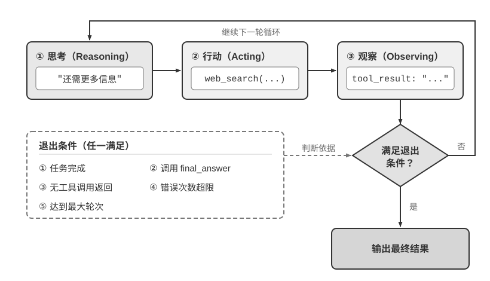

<!-- 自动生成；个人补充请写入 personal/。 -->

[全书目录](../../../README.md) · [上级目录](README.md) · [上一篇：如何选择模型](03-%E5%A6%82%E4%BD%95%E9%80%89%E6%8B%A9%E6%A8%A1%E5%9E%8B.md) · [下一篇：护栏与安全性](05-%E6%8A%A4%E6%A0%8F%E4%B8%8E%E5%AE%89%E5%85%A8%E6%80%A7.md)

> 所属章节：[第1章：AI Agent 入门](../README.md)
>
> 来源：[原文及行号](https://github.com/bojieli/ai-agent-book/blob/d1502f59c1a8c40b4d1c51c250238cd9dd836f1b/book/chapter1.md#L370-L463) · [在线原书](https://bojieli.github.io/ai-agent-book/book/chapter1/)

<!-- 原文开始 -->

### 编排模式：工作流与自主

编排模式是 Harness 中“上下文与工具”层面的组织方式——它决定了上下文如何在 LLM 调用之间流动、工具如何被调度，以及 Agent 的执行路径是预先设定还是动态生成。Agent 系统的编排方式经历了从简单到复杂的演进过程，每种模式都有其适用场景和相应的取舍。根据 Anthropic 与数十个团队合作构建 LLM Agent 的经验，最成功的实现往往不是使用复杂的框架，而是采用简单、可组合的模式。

在构建 LLM 应用时，应遵循“从简单到复杂”的原则：首先考虑单个 LLM 调用。如果通过优化提示词和上下文示例就能解决问题，就不要引入 Agent 系统。当需要多步骤处理时，对于可以清晰分解为固定子任务的场景，考虑使用工作流。只有当需要动态决策和灵活的执行路径时，才使用自主 Agent。需要记住的是：Agent 系统通常会用延迟和成本换取更好的任务性能，应该谨慎权衡这种交换是否值得。

一个常见的反面例子，是一开始就构建一个非常复杂的工作流或多 Agent 系统。例如为 “从百万条聊天记录中提炼个人记忆” 设计 Agent，一些 AI 模型很容易迅速画出一条看似严谨的流水线：先切分对话片段，再依次安排提取、证据核验、身份解析、记忆整理和合并复核 Agent，最后建立事实图、覆盖账本和不可变版本。每个部件单看都有道理，组合起来却是非常低效、不可靠的。因为复杂工作流的执行拓扑是固定的，遇到新的例外，系统很容易继续增加节点，架构越来越复杂，通用性却越来越差。模型原本可以根据上下文处理的语义判断，反而被工作流写死了。

因此，**Harness 很重要，不等于 Harness 越复杂越好**。Manus 官网用 “Less structure, more intelligence.” 概括这种取舍[^ch1-manus-less-structure]：先给一个能力足够的 Agent 清晰的目标、必要的上下文和可组合的工具，用自然语言告诉它如何像人一样查证、比较、处理冲突；程序只固化权限、不得覆盖原始材料、原子发布等必须始终成立的边界。只有业务约束本身要求，或评估反复暴露出某类稳定失败时，才把对应步骤升级为专门的验证器、独立 Agent 或确定性流程。好的结构不是替 Agent 预演全部思考，而是守住边界，并把边界内的决策空间还给模型。

[^ch1-manus-less-structure]: Manus, “Less structure, more intelligence.” https://manus.im/

#### 工作流模式：确定性的编排

**工作流**（Workflow）是通过预定义的代码路径来编排 LLM 和工具的系统。它的执行路径是确定性的，由开发者预先设计好——每一步做什么、下一步去哪里，都是代码写死的，LLM 只在每个节点内部负责理解和生成。

以一个订机票 Agent 为例，工作流可以设计为四个固定节点：

1. **核实用户身份**——调用身份验证 API，确认用户是谁
2. **搜索可用航班**——根据用户需求查询航班数据库
3. **完成付款**——调用支付接口扣款
4. **确认预订**——调用预订 API 锁定座位，向用户发送确认信息

每个节点内部可以使用 LLM（例如用自然语言理解用户的出行需求），但节点之间的流转顺序是代码固定的——系统不会在付款完成之前去预订座位，也不会在身份核实之前开始搜索航班。

工作流模式有两个核心优势。第一是**严格的流程控制**：开发者可以确保关键步骤不被跳过或乱序执行，例如“付款前不能预订”这类业务规则通过代码强制执行，不依赖 LLM 的判断。第二是**安全性**：由于执行路径是确定的，提示注入或模型犯错最多只能影响当前节点内部的处理，无法让 Agent 跳到不该执行的分支——攻击面被限制在单个节点内。

工作流的主要局限是**缺乏变通性**。当出现预设流程未覆盖的情况时（例如用户在付款环节临时想改签、或航班突然取消需要推荐替代方案），固定的节点路径无法灵活应对，只能走预设的异常处理分支或将控制权交还给人类。

举一个最简单的工作流例子：**文生图**。用户的需求往往就是一句大白话，比如 “帮我画一个 AGI 实现以后程序员的工作场景”；可 Stable Diffusion 这类文生图模型只接受特定风格的提示词——逗号分隔的英文标签、质量词、负面提示词。所以工作流要在用户和生图模型之间安排两个固定节点：

1. **提示词改写**——用 LLM 把用户的自然语言需求改写成文生图模型习惯的提示词格式。对于上面的例子，“AGI 实现以后程序员的工作场景” 是个很宽泛的需求，因此 LLM 还需要认真思考（例如 “AGI 实现之后程序员不需要写代码了，因此应该画一个程序员在海边晒太阳，通过脑机接口指挥 AI 员工”），然后给出具体的场景描述。
2. **图片生成**——用改写后的提示词调用文生图模型，得到图片。

执行路径是代码写死的。这个工作流里的 LLM 节点做的是**翻译**，即把人话转成工具听得懂的输入格式，它存在的原因是文生图模型“听不懂人话”。这种专门给工具（或模型）的能力短板打补丁的 Harness 代码，不妨称为**适配层**。

但如果把生图工具换成具备**原生图像生成**能力的多模态模型，比如 Nano Banana 2、GPT-Image 2，就不再需要提示词改写了。不管用户怎么措辞，模型自己就能听懂、直接出图。

> **实验 1-4 ★：文生图工作流与原生图像生成的对照**
>
> 让同一句大白话需求走两条路线。**工作流路线**：LLM 先把需求改写成 Stable Diffusion 风格的提示词，再调文生图模型出图；**原生路线**：把这句话原样发给支持原生图像生成的多模态模型（如 GPT-Image 2），一次调用直接出图。
> 
> 对照看：提示词改写节点把原始需求改成了什么样子，以及两条路线出的图谁更贴近原始需求。值得分两类需求对照：一类是描述具体的（比如指定了海报文案）；另一类是宽泛的（比如上面的 AGI 工作场景），这类需求下工作流路线仍可能有自己的优势。

这个实验说明：**Harness 里那些给模型能力短板打补丁的部分，会随着模型变强被模型自己内化**。仅仅在本书第一章中，这样的事就已经发生了好几轮：few-shot 示例、“让我们一步一步思考”之类的提示词技巧，被指令微调和推理模型内化了；输出格式修复、JSON 解析容错，被结构化输出和原生工具调用内化了；文生图的提示词改写，被模型的原生多模态理解与生成能力吃掉了。每一轮内化，消灭的都是“翻译”和“脚手架”这类适配层代码。

#### 自主 Agent：动态自主决策

当工作流的固定路径无法满足需求时，我们就需要**自主 Agent**（Autonomous Agent）。自主 Agent 与工作流的核心区别在于：执行路径不是预先定义的，而是 Agent 根据**环境反馈**实时决定的。

仍以订机票为例：自主 Agent 不需要预定义四个固定节点。用户说“帮我订下周三去上海的机票”，Agent 会自行决定先搜索航班、发现需要登录、于是先核实身份、再回来搜索、发现最便宜的航班需要转机、主动询问用户是否接受、用户说不要转机、Agent 调整搜索条件……

这意味着自主 Agent 需要具备自主规划的能力——自主决定执行步骤，还需要能识别失败、调整策略，而不只是在出错时停下来。但自主性不等于无限制——必须设计明确的**停止条件**（任务完成、达到最大迭代次数或遭遇不可恢复的错误），否则 Agent 容易陷入死循环或过度执行。

从实现角度看，自主 Agent 本质上就是在一个循环中使用工具的 LLM，通过持续获取环境反馈来推进任务——这正是前面介绍的 ReAct 循环。常见的退出条件包括：调用最终输出工具、模型返回没有任何工具调用的响应，或者遇到错误、达到最大轮数。

自主 Agent 特别适用于开放式的问题——这类问题难以预测所需的步骤数量。典型的应用场景包括：Coding Agent 解决 SWE-bench（Software Engineering Benchmark，一个评估 Agent 自动修复真实 GitHub Issue 能力的基准测试）任务，“计算机使用”（Computer Use）Agent 像人类一样操作计算机界面，以及需要迭代搜索和分析的研究任务。

不过，自主性也带来了更高的成本和潜在的复合错误风险。因此在部署自主 Agent 时，必须在沙盒环境中进行充分的测试，设置适当的护栏和监控机制，并在关键决策点考虑加入人机协作的检查点。

#### 两种模式的选择与混合

实践中，工作流和自主 Agent 并非非此即彼——很多系统会混合使用两种模式：关键的、有严格合规要求的流程用工作流来确保可靠性，需要灵活决策的部分切换到自主模式。例如，n8n 是一个成熟的工作流自动化开源框架，开发者通过可视化界面拖拽功能组件来构建 Agent，可以在同一个系统中同时使用工作流节点和自主 Agent 节点。

还有一种混合方式是**先由自主 Agent 把工作流写出来，再由工作流去执行**。Agent 读完任务后自行决定拓扑并生成一段编排代码；代码一旦生成，执行阶段就退回工作流的确定性。这样既保留了自主 Agent 面对未知任务的灵活性，又不必让模型在每一次调度上都参与决策。第十章会详细讨论这种形态。

#### 主流 Agent 框架简要对比

下表梳理了当前主流的 Agent 框架/平台，帮助读者根据场景快速选型：

| 框架/平台                 | 核心定位                  | 编排模式         | 开发方式                 | 适用场景                                              |
| ------------------------- | ------------------------- | ---------------- | ------------------------ | ----------------------------------------------------- |
| **Codex Harness**         | Codex 的开源 Agent 运行时 | 自主             | 代码优先，可嵌入自有应用 | Coding Agent、把 Agent 嵌进自家产品                   |
| **Claude Agent SDK**      | 生产级 Agent 开发框架     | 自主             | 代码优先                 | 复杂自主任务、Coding Agent                            |
| **LangChain / LangGraph** | 通用 LLM 应用框架         | 工作流 + 自主    | 代码优先                 | 复杂链式思考、多步骤工作流                            |
| **n8n**                   | 可视化工作流自动化        | 工作流 + 自主    | 低代码（可视化拖拽）     | 业务自动化、非技术团队                                |
| **Dify**                  | LLM 应用开发平台          | 工作流 + 对话式  | 低代码（可视化 + API）   | 企业级 RAG、知识库应用                                |
| **CrewAI**                | 角色化多 Agent 编排       | Multi-Agent 协作 | 代码优先                 | 团队式任务分解与执行                                  |
| **OpenClaw**              | 开源全能个人 Agent        | 自主 + 事件驱动  | 配置 + 代码（自托管）    | 个人助理、Deep Research、Computer Use、多平台消息集成 |
| **DeepSeek Harness**      | Agent 自进化框架          | 一切皆插件       | 代码优先，方便定制       | Agent 开发者、研究者                                  |
| **Pi**                    | 极简 Coding Agent 框架    | 自主             | 代码优先，方便定制       | Agent 开发者                                          |

表中前两行值得单独澄清。Codex 是 OpenAI 的 Coding Agent 产品（App、CLI、IDE 扩展），Codex Harness 就是驱动这几种形态的那一层运行时[^ch1-codex-harness]。Codex Harness 提供三条集成路径：`codex exec` 适合脚本与 CI 里的一次性任务；Codex SDK 适合第三方应用代码启动、恢复和流式处理任务；app-server 则通过 JSON-RPC 协议提供持久会话、事件流与审批回调，适合把 Agent 直接做进产品。Claude Agent SDK 与 Claude Code 也是类似的关系，区别在于 Claude 侧对外开放的是 SDK 接口，Harness 实现本身并不开源。

[^ch1-codex-harness]: OpenAI. "Codex as a platform: build on the open agent harness", 2026 年 8 月

注意，Agent 框架发展迅速，在你阅读本书时，很可能有些框架已经过时，又有新的框架流行起来。因此，学会某个具体框架的用法并不重要。选择框架时，关键考量不在于框架本身的复杂度，而在于它能否用尽可能少的抽象层让你专注于业务逻辑。

编排模式解决的是上下文与工具的组织问题。但光能做事还不够，还要确保做得对、做得安全。为此，需要设置护栏，将约束、验证与纠正落实到实践中。

<!-- 原文结束 -->

---

[全书目录](../../../README.md) · [上级目录](README.md) · [上一篇：如何选择模型](03-%E5%A6%82%E4%BD%95%E9%80%89%E6%8B%A9%E6%A8%A1%E5%9E%8B.md) · [下一篇：护栏与安全性](05-%E6%8A%A4%E6%A0%8F%E4%B8%8E%E5%AE%89%E5%85%A8%E6%80%A7.md)
