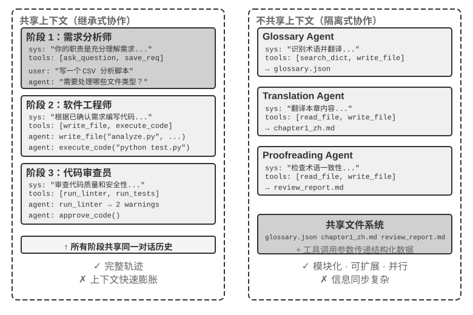

<!-- 自动生成；个人补充请写入 personal/。 -->

[全书目录](../../../README.md) · [上级目录](README.md) · [上一篇：多 Agent 协作的分类框架](README.md) · [下一篇：维度二：协作拓扑](02-%E7%BB%B4%E5%BA%A6%E4%BA%8C%EF%BC%9A%E5%8D%8F%E4%BD%9C%E6%8B%93%E6%89%91.md)

> 所属章节：[第10章：多 Agent 协作](../README.md)
>
> 来源：[原文及行号](https://github.com/bojieli/ai-agent-book/blob/d1502f59c1a8c40b4d1c51c250238cd9dd836f1b/book/chapter10.md#L15-L33) · [在线原书](https://bojieli.github.io/ai-agent-book/book/chapter10/)

<!-- 原文开始 -->

### 维度一：上下文是否共享

这是最基础的架构决策，决定了多个 Agent 之间如何传递信息。

**共享上下文**意味着后续 Agent 接收前一个 Agent 的完整对话历史和轨迹（第一章定义的 trajectory）。每个阶段切换系统提示词和工具集后，就变成了一个新的 Agent（因为它的身份、职责和能力都发生了变化），但它保留了前任的全部记忆。比如一个团队里，需求分析师写完需求文档后，开发者不仅拿到了文档，还能看到分析师与用户的所有沟通记录——他是一个新角色，但完整保留了之前的上下文。优势在于信息不丢失，每个 Agent 都能回顾之前任何阶段的细节；挑战在于上下文可能快速膨胀。

**不共享上下文**意味着每个 Agent 维护完全独立的上下文和对话历史，彼此无法直接访问对方的“思考过程”。这就像不同部门之间的协作：每个人在自己的工位上独立工作，通过共享文档和会议纪要交换信息，而不是时刻盯着别人的屏幕。这种模式的模块化和隔离性更好，每个 Agent 只需关注与自身职责相关的信息；系统也更易扩展和维护——增加新 Agent 不需要改动现有 Agent 的内部逻辑，只需定义好接口和数据格式。

由于 Agent 之间不共享上下文，必须通过显式的通信机制传递信息。这个问题在经典分布式系统中早有答案：操作系统教科书告诉我们，进程间通信（IPC）归根结底只有两大范式——**共享内存**（一方写入、另一方读取同一块存储）和**消息传递**（把数据显式地发送给对方）。Agent 间的通信机制同样落在这两个范式之内，常见的有三种：

- **工具调用的参数**：把下游 Agent 封装成工具，上游 Agent 把结构化数据通过工具参数传给下游 Agent，适合需要类型确定、结构清晰的场景；
- **共享文件系统**：Agent 之间通过读写共享目录下的文档、代码等中间产物来交换信息，适合产物较大或需要持久化的场景；
- **消息总线（Message Bus）**：一个专门负责在 Agent 之间传递消息的中转站，Agent 不直接调用彼此，而是把消息发送到消息总线，由它转发给目标 Agent。

对应到 IPC 的两大范式：共享文件系统就是 Agent 世界的“共享内存”；工具调用参数和消息总线则是“消息传递”的两种形态——前者随调用同步传递，后者经中转站异步投递。两种范式各有取舍。Go 语言有一句广为流传的话：“不要通过共享内存来通信，而要通过通信来共享内存”。

<!-- 原文结束 -->

---

[全书目录](../../../README.md) · [上级目录](README.md) · [上一篇：多 Agent 协作的分类框架](README.md) · [下一篇：维度二：协作拓扑](02-%E7%BB%B4%E5%BA%A6%E4%BA%8C%EF%BC%9A%E5%8D%8F%E4%BD%9C%E6%8B%93%E6%89%91.md)
