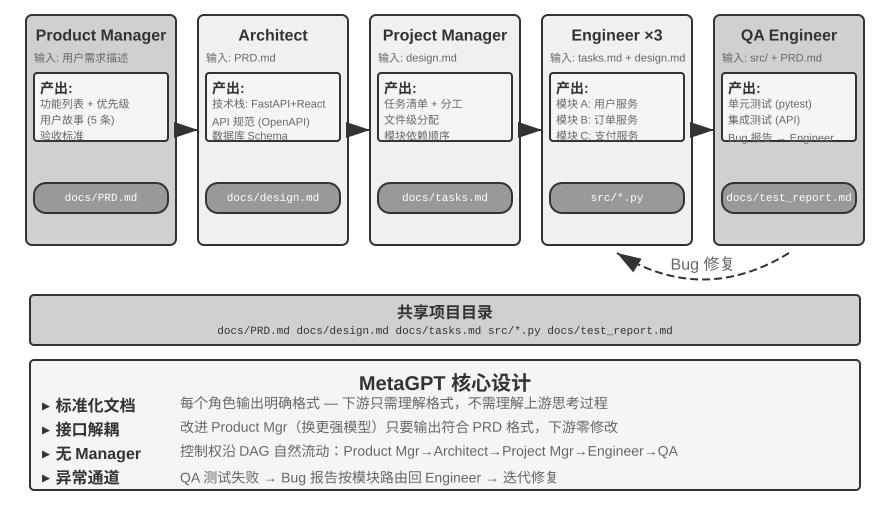

<!-- 自动生成；个人补充请写入 personal/。 -->

[全书目录](../../../README.md) · [上级目录](README.md) · [上一篇：管理者模式：中心化协调](04-%E7%AE%A1%E7%90%86%E8%80%85%E6%A8%A1%E5%BC%8F%EF%BC%9A%E4%B8%AD%E5%BF%83%E5%8C%96%E5%8D%8F%E8%B0%83.md) · [下一篇：跨组织协作：A2A 协议](06-%E8%B7%A8%E7%BB%84%E7%BB%87%E5%8D%8F%E4%BD%9C%EF%BC%9AA2A%E5%8D%8F%E8%AE%AE.md)

> 所属章节：[第10章：多 Agent 协作](../README.md)
>
> 来源：[原文及行号](https://github.com/bojieli/ai-agent-book/blob/d1502f59c1a8c40b4d1c51c250238cd9dd836f1b/book/chapter10.md#L443-L512) · [在线原书](https://bojieli.github.io/ai-agent-book/book/chapter10/)

<!-- 原文开始 -->

<a id="去中心化模式"></a>

### 去中心化模式

有了管理者模式，为什么还要去中心化模式？去掉中心控制者的动机，主要在于模拟人类社会的组织方式：让多个职责对等的角色分工与制衡，各自从自己的专业视角审视问题、自主决定与谁沟通，而不是把所有判断都汇集到一个 Manager 那里。在去中心化模式中，每个 Agent 根据自己的专业判断，自主决定何时向其他 Agent 发起沟通——可能是移交任务（“我的部分做完了，交给你”），也可能是请求反馈（“这个方案技术上可行吗？”），或者报告问题（“你给的需求有矛盾，我们需要重新讨论”）。

去中心化模式还有助于解决 Agent 的稳定性问题。由于模型或 API 服务的问题，一些 Agent 可能停止响应、工具调用失败、陷入错误工具调用的死循环等。在管理者模式中，**管理者 Agent 崩溃往往会成为系统最大的单点故障**。去中心化模式有助于解决这一问题。

微服务领域把管理者和去中心化模式分别称为**编排**（orchestration）与**编舞**（choreography）：前者由指挥统一调度，后者靠每位舞者自行把握入场时机。

下面三个案例是一条递进线索：MetaGPT 控制流其实是固定流水线（伪去中心化，只在通信机制上解耦），AutoGen group chat 是共享对话记录加中心化调度的混合形态，直到 OpenAI Swarm 才在控制流上做到真正的对等去中心化。

**MetaGPT：SOP 驱动的软件公司模拟。**





MetaGPT 的核心洞察是：人类软件公司积累的**标准作业程序**（SOP，Standard Operating Procedure）本身就是被反复验证过的协作协议——把 SOP 编码进多 Agent 系统，让每个角色像流水线上的专业工种一样产出标准化交付物，交付物天然构成了角色间的通信接口。

在 MetaGPT 中，各角色沿固定顺序工作（Product Manager → Architect → Project Manager → Engineer → QA），每个角色输出结构化的 “移交包”：

- **Product Manager Agent**：接收需求描述，生成结构化 PRD（产品需求文档，含功能列表、用户故事、验收标准、优先级排序）
- **Architect Agent**：读取 PRD，做出架构决策（技术栈选择、模块划分、接口定义、数据模型设计），输出设计文档
- **Project Manager Agent**：读取架构设计，把系统拆解为具体的任务清单和文件级分工，理清各模块的依赖顺序，再把任务分派给工程师
- **Engineer Agents**：读取设计文档，实现所负责的模块，产出代码。可以多实例并行工作
- **QA Engineer Agent**：读取代码和 PRD，生成测试用例、执行测试、记录 bug，输出测试报告

实践中一个有效的 “移交包” 通常包含三部分：**任务描述**（接收方要做什么、验收标准是什么）、**已确认的事实与约束**（用户偏好、业务规则、前序阶段敲定的决策），以及**结构化产物的引用**（文件路径而非文件内容，接收方按需读取）。每个 Agent 不需要理解其他 Agent 的 “思考过程”，只需要理解移交包和产物的格式与语义。

MetaGPT 真正对去中心化通信的贡献，在于它的信息传递机制：**共享消息池 + 按角色订阅**。每个角色把结构化消息发布到一个所有角色可见的消息池中，其他角色根据自己的订阅配置，只取用与自身职责相关的消息——而不是点对点地一对一传话。发布者不需要知道谁会消费自己的输出，新增角色只需声明订阅哪些消息类型，无需改动任何现有角色。这带来了真正的解耦：比如把 Product Manager 换成更强的模型，只要它发布的 PRD 仍然符合规范，其他所有 Agent 都无需修改。

需要如实说明的是，MetaGPT 在**控制流**上并不是去中心化的——角色顺序由 SOP 预先固定，整体更接近一条流水线（用第一章的语言说是工作流）。它被放在本节讨论，是因为消息池加订阅的通信机制展示了去中心化系统最关键的设计要素：解耦。至于“QA 直接找 Product Manager 澄清需求”“Engineer 找 Architect 讨论替代方案”这类多向动态反馈，是对这一架构的自然扩展设想，原版 MetaGPT 并未实现。

**AutoGen 群聊。** 

AutoGen 的群聊（group chat）让多个 Agent 参与同一场会话：每轮由一个 “发言者选择器” 决定下一个发言的 Agent。选择器可以是简单的轮转规则，也可以是一个 LLM 根据当前对话内容判断谁最适合接话；任何 Agent 的发言对所有参与者可见。它并不是完全去中心化的系统：发言者的选择由一个中心化的 GroupChatManager 统一裁决，而 “轮到谁发言” 本身就是一种控制流决策。它是 “共享对话记录 + 中心化调度”的混合形态，所有 Agent 看到同一份公共对话记录，但各自保有独立的系统提示词和工具集，而调度权集中在选择器手里。

**OpenAI Swarm。**

OpenAI Swarm 是控制流真正实现对等去中心化的代表：每个 Agent 配备若干 handoff（移交）选项，可以在任何时刻把控制权移交给网络中的任意其他 Agent。系统中没有中心调度者，控制权像接力棒一样在对等的 Agent 之间流转，路由决策完全分散在每个 Agent 自己的判断里。与共享上下文的多 Agent 协作不同，handoff 只应传递明确的任务包和产物引用，不应默认暴露完整私有轨迹。对等移交的风险则是成环：A 移交给 B，B 又移交回 A，任务在环路中空转，因此需要移交次数上限之类的保护机制。

去中心化 handoff 的最小协议可以表示为：

```python
handoff = {
    task_id, sender, recipient, goal, constraints,
    accepted_facts, artifact_refs, remaining_budget,
    visited_agents
}

if recipient in handoff.visited_agents:
    reject("cycle")
elif handoff.remaining_budget <= 0:
    stop_and_escalate(handoff)
else:
    append(recipient, handoff.visited_agents)
    run_local_agent(handoff)
```

它把“上下文隔离”变成可检查的接口：接收者读任务包和引用，按需取证；预算、访问链和循环检测由运行时保留，不能由任一 Agent 自行删除。

> 2025 年以来，“Agent Swarm”（智能体集群）成为各厂商的热门词汇，但它并不对应单一架构。业界用法大致有两类：其一，OpenAI Swarm 式的 handoff 网络（LangGraph 的 swarm 库、微软 Agent Framework 的 handoff 编排同此），是本节的去中心化模式；其二，一些主流商业产品的 Agent Swarm 是规模化的管理者模式：Kimi K2.5 首发的 Agent Swarm 由主 Agent 动态创建上百个子 Agent 并行执行，把 “何时拆、拆几个” 的编排决策通过并行 Agent 强化学习直接训练进模型，K3 将其延续为独立模型档位并开源了配套的并行 Agent 训练沙箱 AgentEnv[^ch10-kimi-swarm]；Anthropic 的多 Agent 研究系统与 Manus 的 Wide Research 同属 orchestrator-worker 星型拓扑。希望读者在阅读本书之后，能够看清概念背后的实质，分析不同多 Agent 系统的实际结构，而不被名称迷惑。

**同一台机器上的多个对等 Agent 实例。**

以上三个系统的 Agent 都在合作完成同一件事，还有一类去中心化则是各干各的：每个 Agent 有自己的任务，它们之间通信不是为了分工，而是为了协调使用共享资源。Claude Code 已经支持同一台机器上的多个 Agent 互相发现（这正是第四章 `list_agents` 的用途）并互相发消息：两个 Agent 在修改同一组文件时协商解决冲突，机器上只有一块 GPU 而两个实例都要跑训练时要协调使用 GPU。

去中心化模式进一步的演进是 Agent 社会，这将在本章最后介绍。

[^ch10-kimi-swarm]: Moonshot AI, *Kimi Agent Swarm: 100 Sub-Agents at Scale*, 2026, https://www.kimi.com/blog/agent-swarm；GTC 2026 上披露并行子 Agent 上限已扩展至 300 个；AgentEnv 为月之暗面与 KVCache.ai 合作开源的 Agent 训练沙箱，随 Kimi K3 于 2026 年 7 月发布。


<!-- 原文结束 -->

---

[全书目录](../../../README.md) · [上级目录](README.md) · [上一篇：管理者模式：中心化协调](04-%E7%AE%A1%E7%90%86%E8%80%85%E6%A8%A1%E5%BC%8F%EF%BC%9A%E4%B8%AD%E5%BF%83%E5%8C%96%E5%8D%8F%E8%B0%83.md) · [下一篇：跨组织协作：A2A 协议](06-%E8%B7%A8%E7%BB%84%E7%BB%87%E5%8D%8F%E4%BD%9C%EF%BC%9AA2A%E5%8D%8F%E8%AE%AE.md)
