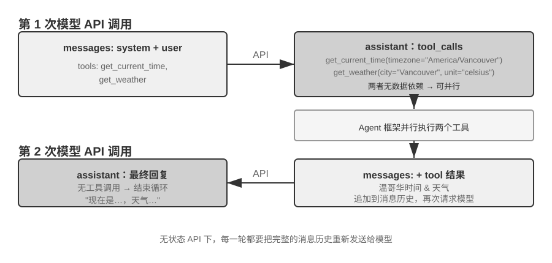

<!-- 自动生成；个人补充请写入 personal/。 -->

[全书目录](../../../README.md) · [上级目录](README.md) · [上一篇：单轮对话：最简单的 API 调用](02-%E5%8D%95%E8%BD%AE%E5%AF%B9%E8%AF%9D%EF%BC%9A%E6%9C%80%E7%AE%80%E5%8D%95%E7%9A%84API%E8%B0%83%E7%94%A8.md) · [下一篇：用代码实现 Agent 的核心循环](04-%E7%94%A8%E4%BB%A3%E7%A0%81%E5%AE%9E%E7%8E%B0Agent%E7%9A%84%E6%A0%B8%E5%BF%83%E5%BE%AA%E7%8E%AF.md)

> 所属章节：[第2章：上下文工程](../README.md)
>
> 来源：[原文及行号](https://github.com/bojieli/ai-agent-book/blob/d1502f59c1a8c40b4d1c51c250238cd9dd836f1b/book/chapter2.md#L95-L250) · [在线原书](https://bojieli.github.io/ai-agent-book/book/chapter2/)

<!-- 原文开始 -->

<a id="带工具调用的多轮交互agent-的核心循环"></a>

### 带工具调用的多轮交互：Agent 的核心循环

真正的 Agent 场景远比单轮问答复杂。当用户问 “What's the current time and weather in Vancouver?” 时，模型无法凭自身知识回答（它不知道“现在”是什么时候，更不知道天气了），需要调用外部工具。下面完整展示这个过程中 Agent 框架与模型之间的每一步交互。



图中的两次调用均指**调用模型 API**，而不是先后调用两个工具。在这个例子中，`get_current_time` 的时区参数和 `get_weather` 的城市、单位参数都可以直接确定；天气服务会自行返回该城市的最新天气，不依赖时间工具的输出，因此 Agent 框架可以并行执行它们。如果后一个工具的参数必须来自前一个工具的结果，模型就需要在后续一轮中再发起工具调用，两个工具只能串行执行。

**第一次 API 调用——Agent 框架发送初始请求：**

```javascript
// ═══ Request constructed by the Agent framework (1st call) ═══
{
  "model": "Qwen3-0.6B",
  "messages": [
    {
      "role": "system",                           // ← Written by developer
      "content": "You are a helpful assistant. Use the provided tools to get real-time information when needed."
    },
    {
      "role": "user",                              // ← User input
      "content": "What's the current time and weather in Vancouver?"
    }
  ],
  "tools": [                                       // ← Tools defined by developer
    {
      "type": "function",
      "function": {
        "name": "get_current_time",
        "description": "Get the current date and time in a specific timezone",
        "parameters": {
          "type": "object",
          "properties": {
            "timezone": { "type": "string", "description": "Timezone name, e.g. America/Vancouver" }
          }
        }
      }
    },
    {
      "type": "function",
      "function": {
        "name": "get_weather",
        "description": "Get the current weather for a specific city",
        "parameters": {
          "type": "object",
          "properties": {
            "city": { "type": "string", "description": "City name" },
            "unit": { "type": "string", "enum": ["celsius", "fahrenheit"] }
          }
        }
      }
    }
  ]
}
```

这份 `tools` 清单是开发者事先注册好的静态工具元数据——工具名称、描述和参数 schema 都写在代码里，和用户这次问了什么无关。无论用户问的是温哥华的天气，还是让 Agent 订一张机票，发出去的都是同一份清单；示例中只列出相关的两个工具，是为了让请求体短一些，真实的 Agent 往往一次挂上几十个工具。**并不是 Agent 先把用户输入拆成“查时间”和“查天气”两个子任务，再据此生成对应的工具描述**——拆解发生在模型一侧，就是下面响应里的 `tool_calls`。

**模型返回工具调用请求（不是最终回复）：**

```javascript
// ═══ Response returned by the API (model decides to call tools) ═══
{
  "choices": [{
    "message": {
      "role": "assistant",                         // ← Generated by model
      "content": null,                             // No text response
      "tool_calls": [                              // Model requests two tool calls
        {
          "id": "call_abc123",
          "type": "function",
          "function": {
            "name": "get_current_time",
            "arguments": "{\"timezone\": \"America/Vancouver\"}"
          }
        },
        {
          "id": "call_def456",
          "type": "function",
          "function": {
            "name": "get_weather",
            "arguments": "{\"city\": \"Vancouver\", \"unit\": \"celsius\"}"
          }
        }
      ]
    }
  }]
}
```

注意，模型并没有直接回答用户的问题，而是返回了两个**工具调用请求**——它判断“当前时间”和“天气”需要通过工具获取，而且两者之间没有依赖关系，可以并行调用。**模型只是发出了调用请求，真正执行工具的是 Agent 框架**。这是理解 Agent 架构的关键：模型负责决策（调用什么工具、传什么参数），Agent 框架负责执行（实际调用 API、运行代码）。

**Agent 框架执行工具，然后发起第二次 API 调用：**

Agent 框架拿到模型的工具调用请求后，实际执行这两个工具（比如调用时间 API 和天气 API），然后将**完整的对话历史加上工具执行结果**一起发送给模型：

```javascript
// ═══ Request constructed by the Agent framework (2nd call) ═══
{
  "model": "Qwen3-0.6B",
  "messages": [
    {
      "role": "system",                           // ← Same as 1st call
      "content": "You are a helpful assistant. Use the provided tools to get real-time information when needed."
    },
    {
      "role": "user",                              // ← Same as 1st call
      "content": "What's the current time and weather in Vancouver?"
    },
    {
      "role": "assistant",                         // ← Model output from 1st call, included verbatim
      "content": null,
      "tool_calls": [
        { "id": "call_abc123", "function": { "name": "get_current_time", "arguments": "{\"timezone\": \"America/Vancouver\"}" } },
        { "id": "call_def456", "function": { "name": "get_weather", "arguments": "{\"city\": \"Vancouver\", \"unit\": \"celsius\"}" } }
      ]
    },
    {
      "role": "tool",                              // ← Generated by Agent framework (tool execution result)
      "tool_call_id": "call_abc123",
      "content": "{\"timezone\": \"America/Vancouver\", \"datetime\": \"2025-09-13T05:18:47\", \"day_of_week\": \"Saturday\"}"
    },
    {
      "role": "tool",                              // ← Generated by Agent framework (tool execution result)
      "tool_call_id": "call_def456",
      "content": "{\"city\": \"Vancouver\", \"temperature\": 13.2, \"unit\": \"celsius\", \"conditions\": \"clear\", \"humidity\": 93}"
    }
  ],
  "tools": [ ... ]                                 // ← Same tool definitions as above, omitted
}
```

这里有三个关键细节：

1. **第二次请求包含了第一次的全部对话历史**——system 消息、user 消息、第一次的 assistant 回复（包含工具调用），以及新增的 tool 结果。这就是前面所说的“每次调用都是无状态的”：模型不会“记住”上一次的对话，Agent 框架必须每次都把完整历史送回去。
2. **第一次的 assistant 消息被原样放回消息列表**——这让模型能“看到”自己之前做了什么决策。
3. **tool 消息通过 `tool_call_id` 与对应的工具调用关联**——模型据此知道哪个结果对应哪个调用。

**模型根据工具结果生成最终回复：**

```javascript
// ═══ Response returned by the API (final reply) ═══
{
  "choices": [{
    "message": {
      "role": "assistant",                         // ← Generated by model
      "content": "It's currently 5:18 AM on Saturday, September 13, 2025 in Vancouver.\n\nWeather: 13.2°C with clear skies and 93% humidity. It's quite cool this morning - you might want to grab a jacket."
    }
  }]
}
```

这一次模型没有返回 tool_calls，而是直接给出了文本回复——它判断已经有了足够的信息来回答用户的问题，Agent 就停止执行了。**这个“请求→工具调用→执行→送回结果→再请求”的循环，就是第一章介绍的 ReAct 循环在 API 层面的具体实现。**

如果用户认为还需要更多信息（比如追问 “那东京呢？”），Agent 框架会把用户的追问追加到对话历史的末尾，然后发起又一次模型 API 调用。模型会再次开始返回 tool_calls，Agent 框架再执行、再送回结果，如此循环。


<!-- 原文结束 -->

---

[全书目录](../../../README.md) · [上级目录](README.md) · [上一篇：单轮对话：最简单的 API 调用](02-%E5%8D%95%E8%BD%AE%E5%AF%B9%E8%AF%9D%EF%BC%9A%E6%9C%80%E7%AE%80%E5%8D%95%E7%9A%84API%E8%B0%83%E7%94%A8.md) · [下一篇：用代码实现 Agent 的核心循环](04-%E7%94%A8%E4%BB%A3%E7%A0%81%E5%AE%9E%E7%8E%B0Agent%E7%9A%84%E6%A0%B8%E5%BF%83%E5%BE%AA%E7%8E%AF.md)
