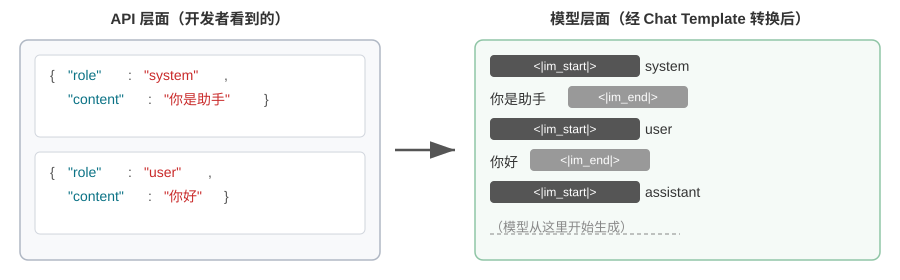

<!-- 自动生成；个人补充请写入 personal/。 -->

[全书目录](../../../README.md) · [上级目录](README.md) · [上一篇：KV Cache 友好的上下文设计](README.md) · [下一篇：KV Cache 的原理与约束](02-KVCache%E7%9A%84%E5%8E%9F%E7%90%86%E4%B8%8E%E7%BA%A6%E6%9D%9F.md)

> 所属章节：[第2章：上下文工程](../README.md)
>
> 来源：[原文及行号](https://github.com/bojieli/ai-agent-book/blob/d1502f59c1a8c40b4d1c51c250238cd9dd836f1b/book/chapter2.md#L502-L525) · [在线原书](https://bojieli.github.io/ai-agent-book/book/chapter2/)

<!-- 原文开始 -->

### 从 API 消息到模型 Token：Chat Template

Chat Template 是一项**贯穿全书的基础机制**：它不只关系到 KV Cache，还决定了多轮工具调用、思维链保留、状态栏注入等诸多机制能否正确工作，因此值得单独讲清楚。注意力可视化实验中的 token 序列（如 `<|im_start|>`、`<|im_end|>` 等特殊标记）看起来与前面 API 的 JSON 格式很不一样。这是因为 API 层面的结构化消息需要被转换为模型能理解的线性 token 流——负责这个转换的就是 **Chat Template**（聊天模板）。

可以把 Chat Template 想象成**信封格式**：API 消息是信的内容，Chat Template 规定了如何在信封上写明寄件人、收件人——用特殊标记（如 `<|im_start|>system`、`<|im_end|>`）划分每条消息的边界和角色。不同的模型家族（Qwen、Llama、Gemma）使用不同的“信封格式”，就像不同国家有不同的邮政编码规则。API 服务端（vLLM、Ollama 等）会根据模型的 Chat Template 自动完成这个转换，开发者通常不需要手动处理。

以 Qwen 系列模型为例，同一段对话在 API 和模型内部看到的是完全不同的形式：

左侧是结构化的 JSON 消息，右侧是模型实际处理的线性 token 流。`<|im_start|>` 和 `<|im_end|>` 是特殊 token，告诉模型每条消息的角色和边界。

对于 Agent 开发者来说，**你不需要手动编写或修改 Chat Template**——API 服务端会自动处理。但理解它的存在对 Agent 开发有两个实用价值：

**第一，解释了为什么必须使用标准 API 格式**。如果开发者绕过 API、自行拼接消息（比如把工具结果作为普通 user 消息而非 tool 类型传递），Chat Template 会误将工具响应识别为新的用户查询，导致模型的思维链保留机制被破坏。

以 Qwen3 的 Chat Template 为例：模型在多轮工具调用中，会把之前的内部思考过程（`<think>` 标签内的内容）保留下来，像草稿纸上的推导步骤，确保思路的连贯性。但当 Chat Template 检测到新的用户查询时，会默认“用户换了个话题”，于是清理之前的思考过程重新开始。问题在于，如果工具结果被错误地标记为用户消息，就会误触发这种清理——相当于模型正算到一半，草稿纸被人收走了，只能从头再来，严重影响多步思考的连贯性。

需要注意的是，不同模型家族对历史思维链的处理策略差异很大，而且策略本身也在快速演变。DeepSeek R1 时代的官方做法是**剥离全部历史思考**：多轮对话时只回传 `content`，不回传 `reasoning_content`——因为 R1 训练时历史 CoT 从不出现在输入里，塞回去属于分布外输入，反而可能干扰输出，同时也能省下可观的 token。但这个策略对 Agent 场景是有缺陷的：中间思考承载着 “为什么调用这个工具、排除了哪些假设” 等关键状态，剥离后模型每轮都从零开始推理，容易重复犯错、丢失长程计划。因此 DeepSeek 在 V4 上**彻底反转**：只要请求携带 `tools` 参数，两个 user 消息之间的每条 assistant 消息（哪怕这一轮并未真的调用工具）都必须原样回传 `reasoning_content`，否则 API 直接返回 400 错误；不带 `tools` 的纯聊天则仍然忽略历史思考。Agent 天然携带 `tools`，因此这条强制规则躲不开——Kimi K2、GLM-5 等也采用了同样的协议。Claude 则要求客户端在工具调用循环中把 thinking block（带签名校验）原样回传给 API，而在新的用户输入之后，服务端会忽略最后一次用户输入之前的 thinking block。因此，使用前应查阅对应模型的最新文档。这些差异在多轮对话里只关系到省不省 token，一旦要把跑到一半的轨迹交给另一家模型接着跑，就会变成实打实的接口错误，详见第五章的实验 5-1。

**第二，解释了 KV Cache 为什么对前缀如此敏感**。Chat Template 将 system 消息和工具定义转换为固定的 token 序列放在最前面。这些 token 的键值对（Key-Value pairs）被缓存后可以跨请求复用。但如果前缀中某个 token 发生变化——哪怕只是系统提示词里多了一个空格——首个不同 token 及其后的缓存就无法复用。

<!-- 原文结束 -->

---

[全书目录](../../../README.md) · [上级目录](README.md) · [上一篇：KV Cache 友好的上下文设计](README.md) · [下一篇：KV Cache 的原理与约束](02-KVCache%E7%9A%84%E5%8E%9F%E7%90%86%E4%B8%8E%E7%BA%A6%E6%9D%9F.md)
