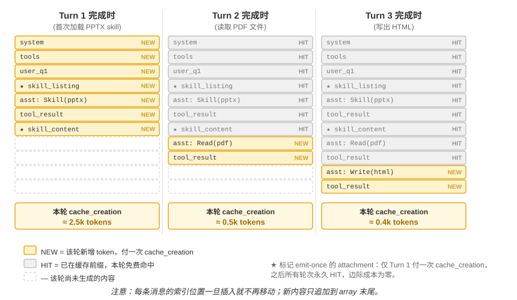

<!-- 自动生成；个人补充请写入 personal/。 -->

[全书目录](../../../README.md) · [上级目录](README.md) · [上一篇：如何编写一份可用的 Skill](02-%E5%A6%82%E4%BD%95%E7%BC%96%E5%86%99%E4%B8%80%E4%BB%BD%E5%8F%AF%E7%94%A8%E7%9A%84Skill.md) · [下一篇：Skills 与工具的关系](04-Skills%E4%B8%8E%E5%B7%A5%E5%85%B7%E7%9A%84%E5%85%B3%E7%B3%BB.md)

> 所属章节：[第2章：上下文工程](../README.md)
>
> 来源：[原文及行号](https://github.com/bojieli/ai-agent-book/blob/d1502f59c1a8c40b4d1c51c250238cd9dd836f1b/book/chapter2.md#L806-L821) · [在线原书](https://bojieli.github.io/ai-agent-book/book/chapter2/)

<!-- 原文开始 -->

### Skills 在上下文中的位置

理解 Skills 的上下文成本时，必须把 “元数据目录” 和 “完整 Skill 指令” 分开：

- **标准层**。规范规定的是加载时序，而不是消息角色：目录必须先于正文可发现，正文在 Skill 被选中后按需加载；具体消息角色、包装方式以及目录是否在每轮重建，都由 Agent Harness 决定。
- **Claude Code 的实现**。Claude Code 采用渐进式目录与调用时追加正文的方式：目录作为运行时上下文消息提供，完整指令则在 Skill 被调用的位置作为 user message 注入。这里的 “system prompt” 可以用来描述逻辑上的稳定指令层，但不应被理解为所有客户端都使用 API 的 `role: "system"`。图2-12 画的是模型自主触发的情形，轨迹里能看到完整的一次往返：`Skill(skill: "pptx")` 的 tool_use、一条占位符 tool_result，正文随后作为独立的 user 消息追加；如果用户直接输入 `/pptx`，客户端在本地完成展开，轨迹里就没有这一对工具调用，只剩下最后那条 user 消息。
- **OpenAI Codex 的实现**：Codex 在每轮上下文构造阶段重新渲染 Skills catalog，并将其作为 `developer` 上下文片段提供；显式选中的 Skill 正文则以带 `<skill>` 标记的 `user` 片段注入。其他来源的 Skill 也可以通过专用工具按需读取[^ch2-codex-skills]。

需要注意，目前 Agent Harness 发展非常快，你读到本书时，它们的实现可能已经改变。尽管不同 Agent Harness 的实现方式不同，但都遵循 **“少量目录常驻、完整正文按需加载”** 的设计原则。这是 Skills 兼顾动态加载能力与上下文开销的关键。为了直观感受这一设计的效果，下面两张图分别从两个视角追踪 Skills 在轨迹中的位置和 KV Cache 的演化。

需要厘清一个常见误解：“对 KV Cache 友好”并非“零成本”。目录首次进入请求需要处理，完整 Skill 正文首次加载时也会产生新增计算；当前缀保持稳定时，后续请求才可以复用缓存。不同 Harness 对目录的重建方式不同，但 Skills 的共同收益是：无需在启动时加载所有 Skill 正文，也无需在每次调用新 Skill 时回头改写已经建立的上下文。

<!-- 原文结束 -->

<!-- 补齐本页引用的原文定义 -->

[^ch2-codex-skills]: OpenAI, ["Build skills"](https://developers.openai.com/codex/skills/), “How ChatGPT and Codex use skills”；OpenAI Codex 公开仓库中的 Skills extension 实现。

---

[全书目录](../../../README.md) · [上级目录](README.md) · [上一篇：如何编写一份可用的 Skill](02-%E5%A6%82%E4%BD%95%E7%BC%96%E5%86%99%E4%B8%80%E4%BB%BD%E5%8F%AF%E7%94%A8%E7%9A%84Skill.md) · [下一篇：Skills 与工具的关系](04-Skills%E4%B8%8E%E5%B7%A5%E5%85%B7%E7%9A%84%E5%85%B3%E7%B3%BB.md)
