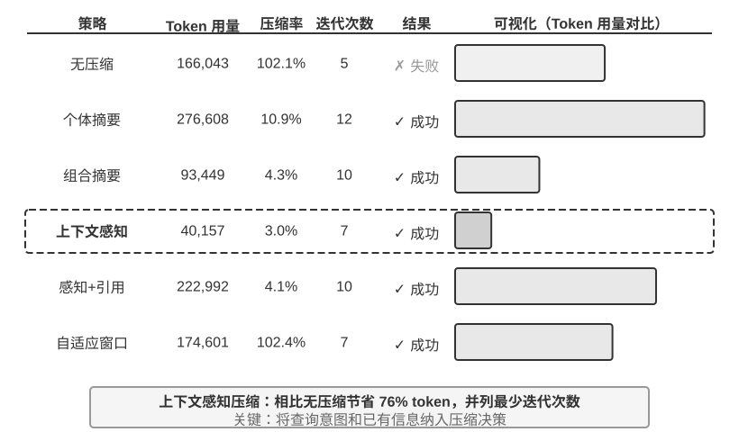
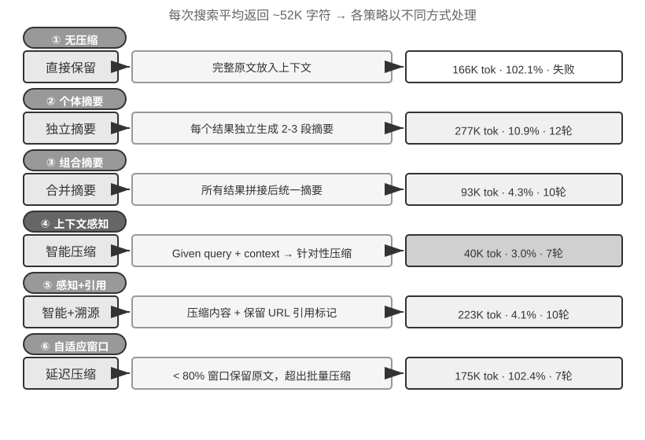

<!-- 自动生成；个人补充请写入 personal/。 -->

[全书目录](../../../README.md) · [上级目录](README.md) · [上一篇：上下文学习的内部机制：检索而非推理](02-%E4%B8%8A%E4%B8%8B%E6%96%87%E5%AD%A6%E4%B9%A0%E7%9A%84%E5%86%85%E9%83%A8%E6%9C%BA%E5%88%B6%EF%BC%9A%E6%A3%80%E7%B4%A2%E8%80%8C%E9%9D%9E%E6%8E%A8%E7%90%86.md) · [下一篇：生产级的分层压缩机制](04-%E7%94%9F%E4%BA%A7%E7%BA%A7%E7%9A%84%E5%88%86%E5%B1%82%E5%8E%8B%E7%BC%A9%E6%9C%BA%E5%88%B6.md)

> 所属章节：[第2章：上下文工程](../README.md)
>
> 来源：[原文及行号](https://github.com/bojieli/ai-agent-book/blob/d1502f59c1a8c40b4d1c51c250238cd9dd836f1b/book/chapter2.md#L1020-L1055) · [在线原书](https://bojieli.github.io/ai-agent-book/book/chapter2/)

<!-- 原文开始 -->

### 压缩与 KV Cache：看似矛盾，实则互补

在讨论具体的压缩策略之前，需要解释一个看似矛盾的问题：前面反复强调 KV Cache 要求上下文前缀保持不变，但压缩不就是要修改上下文中间的内容吗？

关键在于理解压缩发生的**时机和位置**。压缩不是在单次 API 调用的过程中修改上下文，而是在**两次 API 调用之间**，由 Agent 框架对消息列表进行预处理：

1. **System Prompt 和 Tool Definitions 永远不动**——这是上下文最前面的“静态前缀”，KV Cache 持续缓存。
2. **压缩的对象是对话历史中的 tool results**——当 Agent 框架用压缩后的摘要替换原始的工具输出时，替换位置之后的缓存会失效，但之前的缓存仍然有效。
3. **这是一个有意识的权衡**：不压缩，上下文膨胀到超出窗口限制，任务直接失败；压缩后，虽然损失了部分缓存，但上下文长度可控且信息密度更高。因此压缩的频次需要权衡——频繁压缩会频繁破坏缓存，最好在上下文接近阈值时批量压缩，而不是每轮都压。

> **实验 2-10 ★★★：上下文压缩策略对比**
>
> 我们设计了一个研究任务：识别并追踪 OpenAI 联合创始人的职业状态。这个任务需要多步骤的信息聚合，搜索返回的内容长度差异很大（从数千到十几万个字符不等），且有明确的成功标准。使用 Kimi K3（思考模型，原生上下文约 100 万 token；本实验刻意将上下文预算限制在 128K 窗口以触发压缩），我们实现了六种策略：
>
> **策略一：无压缩** —— 将所有工具调用的原始结果完整保留。多次搜索累计返回了约 367,000 个字符（7 次工具调用，平均每次约 52,000 个字符）。到第五次迭代时，上下文累计已超过 128K 限制（约 165,000 token），触发了溢出保护，任务失败。仅需数次搜索就能耗尽 128K 的窗口。
>
> **策略二、三：非任务感知压缩** —— 个体摘要为每个搜索结果独立生成 2-3 段摘要，压缩率 10.9%（本书的压缩率指“压缩后体积 / 原文体积”，数值越小表示压得越狠），能完成任务但需要 12 次迭代、276,608 个 token。主要问题是信息碎片化——多个页面重复描述同一事件，白白浪费了上下文空间。组合摘要则将所有结果合并后生成一份综合摘要，压缩率 4.3%，10 次迭代、93,449 个 token，但当输入超长时必须截断，可能丢失末尾的信息。两者的共同缺陷是：缺乏语义理解，无法区分信息的相关性。
>
> **策略四：上下文感知压缩** —— 核心创新在于将当前的查询意图和已积累的信息纳入压缩的决策过程。通过在压缩提示中指定 “Given the search query: {query}” 和 “Current context: {context}”，引导模型生成有针对性的摘要。结果仅需 7 次迭代、40,157 个 token，整体压缩率约 3.0%。以其中一次压缩为例，将约 150K 个字符压缩到 2K 个字符时，仍保留了创始人姓名与职位变动等后续任务需要的关键信息。
>
> **策略五：带引用的上下文感知** —— 在智能压缩的基础上增加了信息溯源，每条事实都附带来源的 URL 引用标记。内容经过语义压缩（有损），但通过保留源链接（无损索引），理论上可以随时回溯到原始信息。
>
> **策略六：自适应窗口化** —— 基于一个关键认识：任务初期上下文空间充足，无需急于压缩，只有在接近容量限制时才启动压缩机制，从而最大限度地保留原始信息的完整性。具体实现包含三个核心机制：
>
> - **阈值触发**：持续监控上下文使用率，当 prompt token 数超过窗口的 80% 时才激活压缩
> - **批量压缩**：触发时一次性压缩所有未标记的工具结果。例如检测到上下文超过 102,400 token 的阈值后，立即压缩全部 10 个未压缩的工具消息
> - **防重复保护**：添加 `[COMPRESSED]` 标记确保已压缩的内容永不被重复处理
>
> 虽然总的 Token 使用量较大（174,601），但前几次迭代保持了完整的原始信息，为初期广泛的信息收集提供了最大的灵活性。
>
>
> 
>

<!-- 原文结束 -->

---

[全书目录](../../../README.md) · [上级目录](README.md) · [上一篇：上下文学习的内部机制：检索而非推理](02-%E4%B8%8A%E4%B8%8B%E6%96%87%E5%AD%A6%E4%B9%A0%E7%9A%84%E5%86%85%E9%83%A8%E6%9C%BA%E5%88%B6%EF%BC%9A%E6%A3%80%E7%B4%A2%E8%80%8C%E9%9D%9E%E6%8E%A8%E7%90%86.md) · [下一篇：生产级的分层压缩机制](04-%E7%94%9F%E4%BA%A7%E7%BA%A7%E7%9A%84%E5%88%86%E5%B1%82%E5%8E%8B%E7%BC%A9%E6%9C%BA%E5%88%B6.md)
