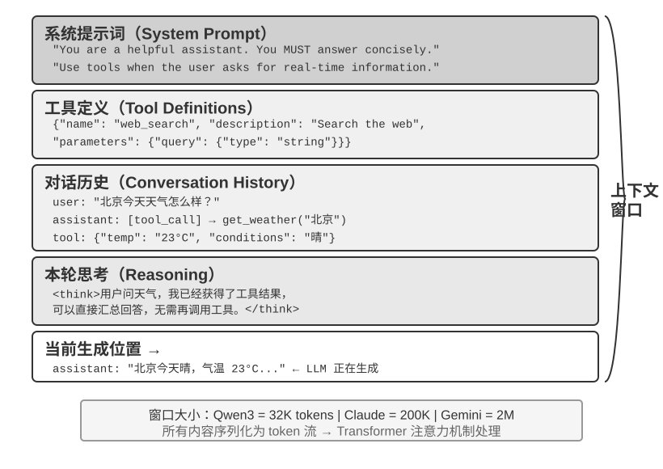

<!-- 自动生成；个人补充请写入 personal/。 -->

[全书目录](../../README.md) · [上级目录](../../README.md) · [上一篇：贯穿全书的设计模式](../chapter1/03-%E8%B4%AF%E7%A9%BF%E5%85%A8%E4%B9%A6%E7%9A%84%E8%AE%BE%E8%AE%A1%E6%A8%A1%E5%BC%8F/README.md) · [下一篇：上下文：决定 Agent 能力上限的关键](01-%E4%B8%8A%E4%B8%8B%E6%96%87%EF%BC%9A%E5%86%B3%E5%AE%9AAgent%E8%83%BD%E5%8A%9B%E4%B8%8A%E9%99%90%E7%9A%84%E5%85%B3%E9%94%AE/README.md)

> 所属章节：[第2章：上下文工程](README.md)
>
> 来源：[原文及行号](https://github.com/bojieli/ai-agent-book/blob/d1502f59c1a8c40b4d1c51c250238cd9dd836f1b/book/chapter2.md#L1-L6) · [在线原书](https://bojieli.github.io/ai-agent-book/book/chapter2/)

<!-- 原文开始 -->

# 上下文工程

第一章把上下文比作 Agent 的“眼睛”——Agent 只能基于它看到的信息做决策。上下文的设计和管理称为**上下文工程（Context Engineering）**。所谓上下文，就是每次你和 AI 对话时，AI 实际“看到”的全部信息。它不仅包含你们之前聊了什么（对话历史），还包含开发者预先写好的行为规则（系统指令）、AI 可以使用的外部功能说明（工具描述）等各类信息。从第一章引入的 Harness 工程视角来看，上下文工程是 Harness 中“上下文与工具”层面的核心实现，它决定了 Agent 在每个决策点能看到什么信息、以什么样的结构看到这些信息。一个设计精良的上下文就是一套高效的信息供给系统，让 Agent 的通用思考能力得以在具体任务中充分发挥。

<!-- 原文结束 -->

## 阅读目录

- [上下文：决定 Agent 能力上限的关键](01-%E4%B8%8A%E4%B8%8B%E6%96%87%EF%BC%9A%E5%86%B3%E5%AE%9AAgent%E8%83%BD%E5%8A%9B%E4%B8%8A%E9%99%90%E7%9A%84%E5%85%B3%E9%94%AE/README.md)
- [Agent 如何调用大模型：理解 API 的上下文结构](02-Agent%E5%A6%82%E4%BD%95%E8%B0%83%E7%94%A8%E5%A4%A7%E6%A8%A1%E5%9E%8B%EF%BC%9A%E7%90%86%E8%A7%A3API%E7%9A%84%E4%B8%8A%E4%B8%8B%E6%96%87%E7%BB%93%E6%9E%84/README.md)
- [KV Cache 友好的上下文设计](03-KVCache%E5%8F%8B%E5%A5%BD%E7%9A%84%E4%B8%8A%E4%B8%8B%E6%96%87%E8%AE%BE%E8%AE%A1/README.md)
- [提示工程：优化系统提示词](04-%E6%8F%90%E7%A4%BA%E5%B7%A5%E7%A8%8B%EF%BC%9A%E4%BC%98%E5%8C%96%E7%B3%BB%E7%BB%9F%E6%8F%90%E7%A4%BA%E8%AF%8D/README.md)
- [动态提示词与 Agent Skills](05-%E5%8A%A8%E6%80%81%E6%8F%90%E7%A4%BA%E8%AF%8D%E4%B8%8EAgentSkills/README.md)
- [Agent 状态栏：通过元信息增强 Agent 轨迹管理](06-Agent%E7%8A%B6%E6%80%81%E6%A0%8F%EF%BC%9A%E9%80%9A%E8%BF%87%E5%85%83%E4%BF%A1%E6%81%AF%E5%A2%9E%E5%BC%BAAgent%E8%BD%A8%E8%BF%B9%E7%AE%A1%E7%90%86/README.md)
- [上下文压缩策略](07-%E4%B8%8A%E4%B8%8B%E6%96%87%E5%8E%8B%E7%BC%A9%E7%AD%96%E7%95%A5/README.md)

---

[全书目录](../../README.md) · [上级目录](../../README.md) · [上一篇：贯穿全书的设计模式](../chapter1/03-%E8%B4%AF%E7%A9%BF%E5%85%A8%E4%B9%A6%E7%9A%84%E8%AE%BE%E8%AE%A1%E6%A8%A1%E5%BC%8F/README.md) · [下一篇：上下文：决定 Agent 能力上限的关键](01-%E4%B8%8A%E4%B8%8B%E6%96%87%EF%BC%9A%E5%86%B3%E5%AE%9AAgent%E8%83%BD%E5%8A%9B%E4%B8%8A%E9%99%90%E7%9A%84%E5%85%B3%E9%94%AE/README.md)
