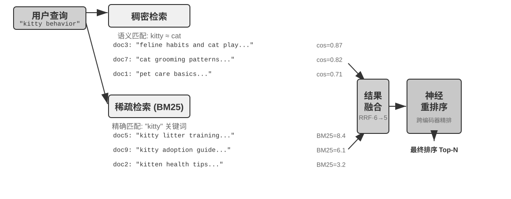

<!-- 自动生成；个人补充请写入 personal/。 -->

[全书目录](../../../README.md) · [上级目录](README.md) · [上一篇：稀疏嵌入：精确匹配的关键词检索](03-%E7%A8%80%E7%96%8F%E5%B5%8C%E5%85%A5%EF%BC%9A%E7%B2%BE%E7%A1%AE%E5%8C%B9%E9%85%8D%E7%9A%84%E5%85%B3%E9%94%AE%E8%AF%8D%E6%A3%80%E7%B4%A2.md) · [下一篇：超越扁平文本：知识的组织与检索](../03-%E8%B6%85%E8%B6%8A%E6%89%81%E5%B9%B3%E6%96%87%E6%9C%AC%EF%BC%9A%E7%9F%A5%E8%AF%86%E7%9A%84%E7%BB%84%E7%BB%87%E4%B8%8E%E6%A3%80%E7%B4%A2/README.md)

> 所属章节：[第3章：用户记忆和知识库](../README.md)
>
> 来源：[原文及行号](https://github.com/bojieli/ai-agent-book/blob/d1502f59c1a8c40b4d1c51c250238cd9dd836f1b/book/chapter3.md#L385-L423) · [在线原书](https://bojieli.github.io/ai-agent-book/book/chapter3/)

<!-- 原文开始 -->

### 混合检索：两全其美的艺术

两种方法各有盲区：稠密检索懂语义但可能漏掉关键词（搜“HTTP-403”可能返回“服务器错误”的泛泛讨论），稀疏检索精确匹配但读不懂同义词（搜“kitty”找不到只写了“cat”的文档）。混合检索的思路很简单——两个引擎都跑，结果合并——难点在于如何把分布迥异的两组得分整合成一个有意义的排序。

典型的混合检索流水线包含三个阶段，三者各司其职、层层递进。

第一阶段是**并行检索**，系统同时向稠密和稀疏两个引擎发送查询，各自召回一部分候选文档。

第二阶段是**结果融合**，负责把两路结果合成一个统一的候选池。难点在于两路得分不可直接比较：稠密检索的余弦相似度得分（通常是 0 到 1）和稀疏检索的 BM25 得分（可能是 0 到几十的任意值），尺度和分布完全不同。常用的融合方法是**倒数排名融合**（Reciprocal Rank Fusion, RRF），完全抛开原始得分、只看排名，每个文档的综合得分是它在各路结果中排名的平滑倒数之和，即得分 = Σ 1/(k + rank)，其中 k 是平滑常数（常取 60），用于压低排名最靠前几个位置之间的得分差距。RRF 简单且稳健，但只利用了排名信息，丢失了原始得分中蕴含的丰富相关性信号。

不过要强调的是，流水线的第三个阶段**神经重排序（Neural Reranking）** 并不是为了“补救 RRF 丢掉的得分”才存在的：无论前一步用哪种方式融合，重排序都值得加，因为它换用了一种更强的匹配范式。它让跨编码器对查询和文档做深度交互匹配，精度远高于检索阶段双编码器各自独立编码、再靠向量运算比相似度的做法。具体做法是对融合产生的候选池中排名靠前的 N 个候选（如前 50 个）逐一精确打分，产生最终排序。注意重排序并不**替代**融合：融合负责从两路结果中产生统一的候选池，重排序负责在这个候选池上精排。

打个比方：求职者把简历交给猎头快速筛选，是双编码器；面试官与每位候选人深谈，是跨编码器。前者依靠预先抽取的特征做大规模初筛，后者则让查询和候选文档“面对面”逐字斟酌。重排序器采用的正是“跨编码器（Cross-Encoder）”架构，与检索阶段的“双编码器（Bi-Encoder）”形成鲜明对比。**双编码器**为查询和文档独立生成向量，通过向量运算计算相似度，速度极快，但无法捕捉深层的匹配关系，适合从海量数据中做初步筛选。**跨编码器**则把查询和候选文档**拼接成一段完整的文字**送入模型，让模型逐词比对、输出一个综合的相关性得分，慢得多，但判断更准确。常用的重排序模型如 [BAAI/bge-reranker-v2-m3](https://huggingface.co/BAAI/bge-reranker-v2-m3) 就采用这种架构。

**如何度量检索质量？** 调优这样一条多阶段流水线，需要客观的度量指标，最核心的有三个（均在带标注答案的测试查询集上计算）：

表3-3 检索质量的三个核心指标

| 指标 | 直觉解释 |
|-----------------------------------------|------------------------------------------------------|
| recall@k（召回率@k）[^ch3-recall] | 包含正确答案的文档出现在前 k 个检索结果中的查询比例——回答“该找的找到了吗”，是最贴近 RAG 需求的指标：只要相关文档进入上下文，LLM 就有机会利用它 |
| MRR（Mean Reciprocal Rank，平均倒数排名） | 每个查询取第一个相关文档排名的倒数，再对所有查询取平均——回答“找到得够不够靠前”：排第 1 得 1 分，排第 10 只得 0.1 分 |
| nDCG（normalized Discounted Cumulative Gain，归一化折损累积增益） | 综合考虑所有相关文档的排名与相关程度，排名越靠后的相关文档得分折扣越大——回答“整个排序列表的质量如何” |

[^ch3-recall]: 严格说，本书这里定义的“recall@k”实为**命中率**（hit rate，也叫 success@k）——只要前 k 个结果里有一篇相关文档就算命中。学术上标准的 recall@k 指的是**相关文档被召回的比例**（前 k 个结果中相关文档数 ÷ 该查询全部相关文档数）；当一个查询有多篇相关文档时，两者并不相等。本书沿用这一简化口径，是为了与后文引用的 Anthropic “Contextual Retrieval” 的报告口径保持一致，读者在跨来源比较时需留意各自的确切定义。

工业界的报告中还常见“检索失败率”的说法。例如**检索失败率**指正确信息未出现在 top-20 检索结果中的查询比例。

> **实验 3-6 ★★：混合检索流水线：结合稀疏、稠密与重排序**
>
> `retrieval-pipeline` 项目构建了一套完整的教育性检索流水线，包含稠密检索、稀疏检索和神经重排序。`test_client.py` 中包含一系列测试案例，每个都旨在突出一种特定的信息检索挑战。
>
> `test_client.py` 中的测试案例，正对应前面“混合检索”一节指出的几类挑战——语义相似（如“kitty”对“feline/cat”）、精确名称、多语言查询、技术代码——可直接观察稠密与稀疏两路在每类查询下各自的胜负，此处不再逐一复述例子。
>
> 最引人注目的是重排序器在提升最终结果质量上的显著作用。系统不仅返回重排序列表，还详细展示每个文档在原始稠密和稀疏检索中的排名以及重排序后的变化。通过分析这些“排名变化”数据，可清晰看到神经重排序器如何智能地将被单一方法低估但实际高度相关的文档提升到顶端。实验结果清楚地说明：没有哪种单一检索策略在所有场景下都可靠。把稠密、稀疏和重排序组合起来，才是构建生产级 RAG 系统的正确做法。

<!-- 原文结束 -->

---

[全书目录](../../../README.md) · [上级目录](README.md) · [上一篇：稀疏嵌入：精确匹配的关键词检索](03-%E7%A8%80%E7%96%8F%E5%B5%8C%E5%85%A5%EF%BC%9A%E7%B2%BE%E7%A1%AE%E5%8C%B9%E9%85%8D%E7%9A%84%E5%85%B3%E9%94%AE%E8%AF%8D%E6%A3%80%E7%B4%A2.md) · [下一篇：超越扁平文本：知识的组织与检索](../03-%E8%B6%85%E8%B6%8A%E6%89%81%E5%B9%B3%E6%96%87%E6%9C%AC%EF%BC%9A%E7%9F%A5%E8%AF%86%E7%9A%84%E7%BB%84%E7%BB%87%E4%B8%8E%E6%A3%80%E7%B4%A2/README.md)
