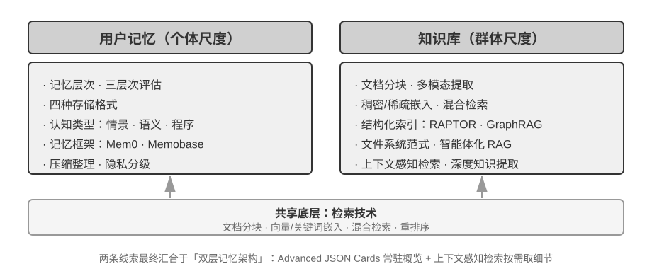

<!-- 自动生成；个人补充请写入 personal/。 -->

[全书目录](../../README.md) · [上级目录](../../README.md) · [上一篇：思考题](../chapter2/09-%E6%80%9D%E8%80%83%E9%A2%98/README.md) · [下一篇：用户记忆系统](01-%E7%94%A8%E6%88%B7%E8%AE%B0%E5%BF%86%E7%B3%BB%E7%BB%9F/README.md)

> 所属章节：[第3章：用户记忆和知识库](README.md)
>
> 来源：[原文及行号](https://github.com/bojieli/ai-agent-book/blob/d1502f59c1a8c40b4d1c51c250238cd9dd836f1b/book/chapter3.md#L1-L14) · [在线原书](https://bojieli.github.io/ai-agent-book/book/chapter3/)

<!-- 原文开始 -->

# 用户记忆和知识库

上一章解决的是单次交互的上下文管理。这一章要处理一个更难的问题：如何让 Agent 在对话结束后仍然记住用户、记住知识。

这种持久化的记忆体系可以从两个尺度来理解。**用户记忆**是针对单个用户的个性化记忆——Agent 在与每位用户的交互中逐渐了解其偏好、习惯和需求，构建专属于该用户的知识模型。**知识库**则是面向所有用户共享的集体知识——比如一个行业的法规体系、一家公司内部的操作流程、一个技术领域的专业文档。前者让 Agent 成为“懂你的助手”，后者让 Agent 成为“领域专家”。

两者解决的其实是同一个问题，只是尺度不同：一个关注个体，一个关注群体。也正因如此，两者共用许多底层技术——向量检索、知识压缩——也面临同样的麻烦：信息冲突、知识过期、检索不准。

延续第二章的上下文工程思路，本章将从单次会话的上下文管理扩展到跨会话的持久化知识体系。我们首先探讨如何构建用户记忆系统，然后深入知识库的检索增强生成（RAG）技术及其在增强用户记忆中的应用。

<!-- 原文结束 -->

## 阅读目录

- [用户记忆系统](01-%E7%94%A8%E6%88%B7%E8%AE%B0%E5%BF%86%E7%B3%BB%E7%BB%9F/README.md)
- [RAG 基础：构建 Agent 的知识获取管道](02-RAG%E5%9F%BA%E7%A1%80%EF%BC%9A%E6%9E%84%E5%BB%BAAgent%E7%9A%84%E7%9F%A5%E8%AF%86%E8%8E%B7%E5%8F%96%E7%AE%A1%E9%81%93/README.md)
- [超越扁平文本：知识的组织与检索](03-%E8%B6%85%E8%B6%8A%E6%89%81%E5%B9%B3%E6%96%87%E6%9C%AC%EF%BC%9A%E7%9F%A5%E8%AF%86%E7%9A%84%E7%BB%84%E7%BB%87%E4%B8%8E%E6%A3%80%E7%B4%A2/README.md)
- [本章小结](04-%E6%9C%AC%E7%AB%A0%E5%B0%8F%E7%BB%93/README.md)
- [思考题](05-%E6%80%9D%E8%80%83%E9%A2%98/README.md)

---

[全书目录](../../README.md) · [上级目录](../../README.md) · [上一篇：思考题](../chapter2/09-%E6%80%9D%E8%80%83%E9%A2%98/README.md) · [下一篇：用户记忆系统](01-%E7%94%A8%E6%88%B7%E8%AE%B0%E5%BF%86%E7%B3%BB%E7%BB%9F/README.md)
