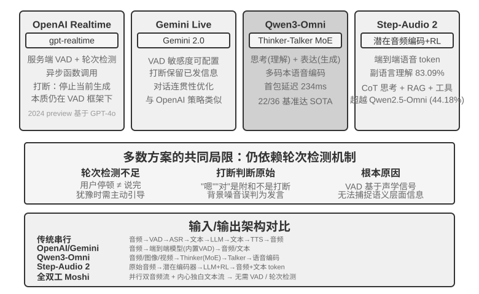

<!-- 自动生成；个人补充请写入 personal/。 -->

[全书目录](../../../README.md) · [上级目录](README.md) · [上一篇：范式一 · 级联流水线（Cascading）](02-%E8%8C%83%E5%BC%8F%E4%B8%80%C2%B7%E7%BA%A7%E8%81%94%E6%B5%81%E6%B0%B4%E7%BA%BF%EF%BC%88Cascading%EF%BC%89.md) · [下一篇：范式三 · 全双工交互模型](04-%E8%8C%83%E5%BC%8F%E4%B8%89%C2%B7%E5%85%A8%E5%8F%8C%E5%B7%A5%E4%BA%A4%E4%BA%92%E6%A8%A1%E5%9E%8B.md)

> 所属章节：[第6章：交互：观察与动作空间的扩展](../README.md)
>
> 来源：[原文及行号](https://github.com/bojieli/ai-agent-book/blob/d1502f59c1a8c40b4d1c51c250238cd9dd836f1b/book/chapter6.md#L389-L403) · [在线原书](https://bojieli.github.io/ai-agent-book/book/chapter6/)

<!-- 原文开始 -->

### 范式二 · 端到端全模态模型（Omni）

级联即使采用流式感知，听、想、说仍通过离散接口交接；情绪、语调和环境声等信息可能在转成纯文本时丢失。Omni 方案用同一个模型直接听音频、生成回复并输出语音，因而有机会保留这些信息，但训练的成本更高（图6-9）。相比范式一的级联方案，Omni 的优势主要体现在延迟和非文字信息的理解和生成上。

在理解方面，Omni 模型可以理解声音中的停顿和。在生成方面，Omni 模型可以传递更丰富的副语言信息，例如唱歌、用特殊的语调讲一句话。

Omni 模型仍然假设轮流说话，通常要靠 VAD 划分发言权。因此，用户报数字时的中途停顿仍可能被误判为说完。

> **实验 6-6 ★★：本地运行 MiniCPM-o 4.5，对比端到端与自级联**
>
> 本实验使用本地 MiniCPM-o 4.5，关闭 thinking mode，比较直接从音频作答与同模型自级联先转录再作答。它测的是音频信息是否被保留，**不是**后文的“边想边说”。

<!-- 原文结束 -->

---

[全书目录](../../../README.md) · [上级目录](README.md) · [上一篇：范式一 · 级联流水线（Cascading）](02-%E8%8C%83%E5%BC%8F%E4%B8%80%C2%B7%E7%BA%A7%E8%81%94%E6%B5%81%E6%B0%B4%E7%BA%BF%EF%BC%88Cascading%EF%BC%89.md) · [下一篇：范式三 · 全双工交互模型](04-%E8%8C%83%E5%BC%8F%E4%B8%89%C2%B7%E5%85%A8%E5%8F%8C%E5%B7%A5%E4%BA%A4%E4%BA%92%E6%A8%A1%E5%9E%8B.md)
