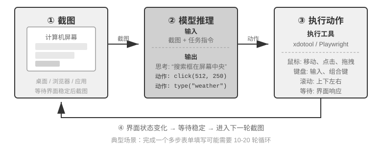

<!-- 自动生成；个人补充请写入 personal/。 -->

[全书目录](../../../README.md) · [上级目录](../README.md) · [上一篇：更像人的语音合成](../03-%E8%AF%AD%E9%9F%B3%EF%BC%9A%E6%9C%80%E8%87%AA%E7%84%B6%E7%9A%84%E4%BA%BA%E6%9C%BA%E6%8E%A5%E5%8F%A3/06-%E6%9B%B4%E5%83%8F%E4%BA%BA%E7%9A%84%E8%AF%AD%E9%9F%B3%E5%90%88%E6%88%90.md) · [下一篇：动作空间设计](01-%E5%8A%A8%E4%BD%9C%E7%A9%BA%E9%97%B4%E8%AE%BE%E8%AE%A1.md)

> 所属章节：[第6章：交互：观察与动作空间的扩展](../README.md)
>
> 来源：[原文及行号](https://github.com/bojieli/ai-agent-book/blob/d1502f59c1a8c40b4d1c51c250238cd9dd836f1b/book/chapter6.md#L460-L478) · [在线原书](https://bojieli.github.io/ai-agent-book/book/chapter6/)

<!-- 原文开始 -->

## Computer Use：GUI 自动化 Agent

语音把时机轴推到了毫秒级，但它的观察仍是一维的声音流。Computer Use 把同一个问题搬上二维的屏幕：观察变成持续变化的像素，动作变成坐标上的点击与输入。语音场景强调“何时开口”，Computer Use 则强调“下一步点哪里”，以及一个语音交互中不存在的问题——动作执行之后，现实是否还与计划一致。

Computer Use（也称 GUI 自动化 Agent）让 AI 像人类一样通过观察屏幕、操作鼠标键盘来使用软件——比如打开浏览器搜索信息、在表格软件中填写数据或在系统设置中调整配置。其核心是一个**感知-思考-行动**的循环（图6-11）：

1. Agent 截取当前屏幕画面
2. 多模态模型接收截图和任务指令，输出一段思考和一个具体动作
3. 执行层在真实环境中执行该动作（移动鼠标、点击、输入文字等）
4. 等待界面响应后再次截图，进入下一轮循环

这里要区分“看懂界面”和“完成任务”。前者更接近多模态理解能力，可以用一次截图问答来测量；后者则要求模型把理解和生成动作放进闭环，处理页面加载、状态变化、误操作和不可逆后果。Computer Use 的难点因此不只是让模型在截图上答对，而是让它在每一步之后重新确认现实是否仍符合计划。

这个循环中有三个关键设计维度：**动作空间**（Agent 能执行哪些操作）、**视觉定位**（如何在截图中找到目标元素）、以及**模型架构**（如何从截图生成正确动作）。

<!-- 原文结束 -->

## 阅读目录

- [动作空间设计](01-%E5%8A%A8%E4%BD%9C%E7%A9%BA%E9%97%B4%E8%AE%BE%E8%AE%A1.md)
- [视觉定位（Grounding）](02-%E8%A7%86%E8%A7%89%E5%AE%9A%E4%BD%8D%EF%BC%88Grounding%EF%BC%89.md)
- [能看动画、能听声音的 Computer Use Agent](03-%E8%83%BD%E7%9C%8B%E5%8A%A8%E7%94%BB%E3%80%81%E8%83%BD%E5%90%AC%E5%A3%B0%E9%9F%B3%E7%9A%84ComputerUseAgent.md)
- [Computer Use 的世界模型](04-ComputerUse%E7%9A%84%E4%B8%96%E7%95%8C%E6%A8%A1%E5%9E%8B.md)
- [移动端：生态壁垒比技术更难](05-%E7%A7%BB%E5%8A%A8%E7%AB%AF%EF%BC%9A%E7%94%9F%E6%80%81%E5%A3%81%E5%9E%92%E6%AF%94%E6%8A%80%E6%9C%AF%E6%9B%B4%E9%9A%BE.md)

---

[全书目录](../../../README.md) · [上级目录](../README.md) · [上一篇：更像人的语音合成](../03-%E8%AF%AD%E9%9F%B3%EF%BC%9A%E6%9C%80%E8%87%AA%E7%84%B6%E7%9A%84%E4%BA%BA%E6%9C%BA%E6%8E%A5%E5%8F%A3/06-%E6%9B%B4%E5%83%8F%E4%BA%BA%E7%9A%84%E8%AF%AD%E9%9F%B3%E5%90%88%E6%88%90.md) · [下一篇：动作空间设计](01-%E5%8A%A8%E4%BD%9C%E7%A9%BA%E9%97%B4%E8%AE%BE%E8%AE%A1.md)
