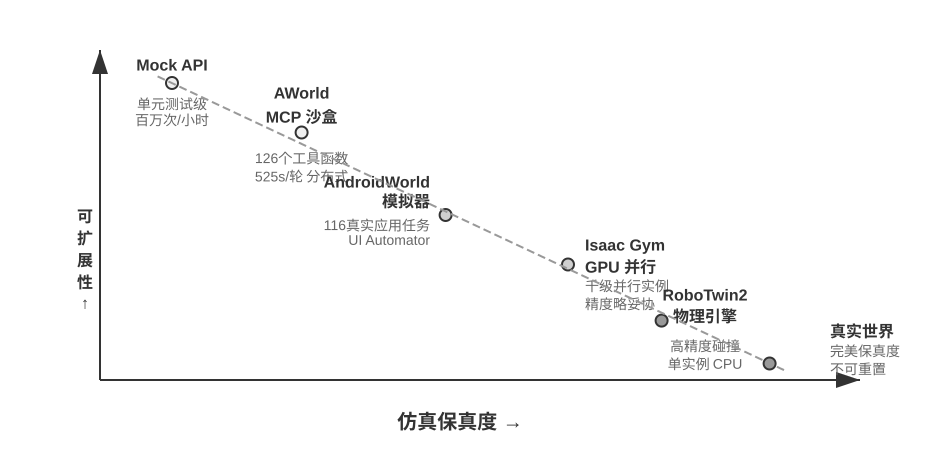

<!-- 自动生成；个人补充请写入 personal/。 -->

[全书目录](../../../README.md) · [上级目录](../README.md) · [上一篇：从外部到内部：评估思维的转变](../10-%E4%BB%8E%E5%A4%96%E9%83%A8%E8%AF%84%E4%BC%B0%E5%88%B0%E5%86%85%E9%83%A8%E8%AF%84%E4%BC%B0%EF%BC%9A%E7%94%9F%E4%BA%A7%E7%BA%A7Agent%E7%9A%84%E8%AF%84%E4%BC%B0%E5%9F%BA%E7%A1%80%E8%AE%BE%E6%96%BD/06-%E4%BB%8E%E5%A4%96%E9%83%A8%E5%88%B0%E5%86%85%E9%83%A8%EF%BC%9A%E8%AF%84%E4%BC%B0%E6%80%9D%E7%BB%B4%E7%9A%84%E8%BD%AC%E5%8F%98.md) · [下一篇：保真度权衡与领域随机化](01-%E4%BF%9D%E7%9C%9F%E5%BA%A6%E6%9D%83%E8%A1%A1%E4%B8%8E%E9%A2%86%E5%9F%9F%E9%9A%8F%E6%9C%BA%E5%8C%96.md)

> 所属章节：[第7章：Agent 的评估](../README.md)
>
> 来源：[原文及行号](https://github.com/bojieli/ai-agent-book/blob/d1502f59c1a8c40b4d1c51c250238cd9dd836f1b/book/chapter7.md#L825-L845) · [在线原书](https://bojieli.github.io/ai-agent-book/book/chapter7/)

<!-- 原文开始 -->

## 仿真环境：从评估到后训练的桥梁

评估的终点不是打分，而是改进。本章已经展示了改进的两条路径：调整 Harness（从 Benchmark 报告到系统改进）和把评估嵌入产品工程（内部评估基础设施）。而最深入的改进方式是训练——当目标从“评估现有能力”扩展到“培养新能力”时，特别是通过第八章讨论的后训练技术，评估环境就需要演化为**仿真环境**：一个能让 Agent 反复练习、自动打分的虚拟操场。仿真环境与评估环境的核心区别在于：交互频率高得多（数百万次 vs 数千次）、需要随机化（防止死记硬背特定配置），而且必须提供即时反馈。从应用领域看，仿真环境分为数字环境（信息处理任务）与具身环境（物理世界感知与操作）两大类。

这座桥梁的两端是这样接起来的。评估侧已经积累的资产可以近乎无缝地转成训练信号：一套定义清晰的 Rubric 或验证器，本质上就是一个**可验证奖励（RLVR，Reinforcement Learning with Verifiable Rewards）**的奖励函数——验证脚本直接就是奖励脚本，测试是否通过、状态是否达标，既是评估的判据，也是强化学习的回报。但训练会提出评估阶段不必操心的新要求。其一是**可靠的 reset 语义**：训练要跑数百万个 episode（一个 episode 即一次从初始状态到任务结束的完整交互回合），每个 episode 都必须能把环境重置到一个确定、干净的初始状态，否则梯度信号会被上一轮的残留状态污染。其二是**远高于评估的吞吐**：评估几千次就够出结论，训练则要在可接受的墙钟时间内喂给模型上百万次交互，环境的并行度和单实例开销直接决定训练是否可行。这两点——奖励函数化的验证器、面向训练的 reset 与吞吐——都将在第八章展开。

**数字环境**方面，AWorld 框架为 GAIA 任务构建了可控的 MCP 服务器沙盒，提供 26 个 MCP 服务器、涵盖 126 个工具函数，避免直接访问真实 API 带来的封禁和不可控副作用。所有工具调用可重放、可审计。AWorld 的分布式架构将传统串行执行的 7695 秒缩短到 525 秒（14.6 倍加速），环境的无状态设计使每个实例完全独立，支持高效并行。

**具身环境**方面，RoboTwin2 基于物理引擎构建双臂操作任务，环境随机化物体位置、朝向和外观以提升泛化能力。观测空间包括多相机视觉和关节状态，通过**动作分块（Action Chunking）**——模型一次规划多个连续动作——实现实时控制（详见第六章）。OSWorld 通过虚拟机快照实现可重置性，AndroidWorld 聚焦移动应用自动化。无论数字环境还是具身环境，仿真环境同样需要第四章讨论的隔离执行环境与虚拟身份机制（VM/容器隔离、住宅代理、Human-in-the-Loop 认证、共享文件系统），此处不再重复。

> **实验 7-14 ★★：配置 OpenVLA 与 RoboTwin2 的具身智能环境**
>
> 搭建机器人操作的仿真环境。阅读 `ch7/SimpleVLA-RL` 和 OpenVLA 文档，理解视觉-语言-动作模型的架构（视觉编码器 + 语言模型 + 动作解码器端到端整合，图像和文本投影到共享语义空间）。配置 RoboTwin2 环境，理解观测空间（三视角 RGB + 14 维关节状态）和动作空间（14 维控制向量）。研究 move_can_pot 中的环境随机化机制和空间约束逻辑。运行预训练模型评估，记录成功率、完成时间和失败模式，重点关注动作分块机制的影响。
>
>
> 
>
>

<!-- 原文结束 -->

## 阅读目录

- [保真度权衡与领域随机化](01-%E4%BF%9D%E7%9C%9F%E5%BA%A6%E6%9D%83%E8%A1%A1%E4%B8%8E%E9%A2%86%E5%9F%9F%E9%9A%8F%E6%9C%BA%E5%8C%96.md)

---

[全书目录](../../../README.md) · [上级目录](../README.md) · [上一篇：从外部到内部：评估思维的转变](../10-%E4%BB%8E%E5%A4%96%E9%83%A8%E8%AF%84%E4%BC%B0%E5%88%B0%E5%86%85%E9%83%A8%E8%AF%84%E4%BC%B0%EF%BC%9A%E7%94%9F%E4%BA%A7%E7%BA%A7Agent%E7%9A%84%E8%AF%84%E4%BC%B0%E5%9F%BA%E7%A1%80%E8%AE%BE%E6%96%BD/06-%E4%BB%8E%E5%A4%96%E9%83%A8%E5%88%B0%E5%86%85%E9%83%A8%EF%BC%9A%E8%AF%84%E4%BC%B0%E6%80%9D%E7%BB%B4%E7%9A%84%E8%BD%AC%E5%8F%98.md) · [下一篇：保真度权衡与领域随机化](01-%E4%BF%9D%E7%9C%9F%E5%BA%A6%E6%9D%83%E8%A1%A1%E4%B8%8E%E9%A2%86%E5%9F%9F%E9%9A%8F%E6%9C%BA%E5%8C%96.md)
