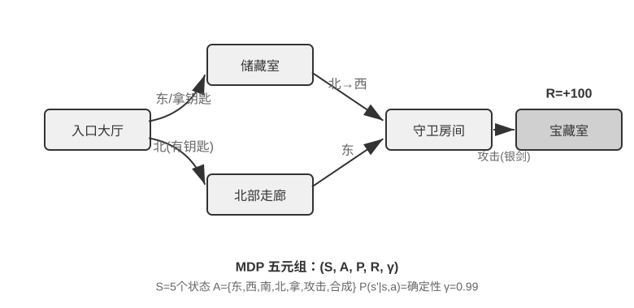
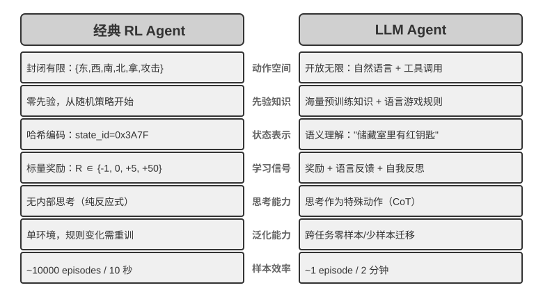

<!-- 自动生成；个人补充请写入 personal/。 -->

[全书目录](../../../README.md) · [上级目录](README.md) · [上一篇：Agent 与环境的交互](01-Agent%E4%B8%8E%E7%8E%AF%E5%A2%83%E7%9A%84%E4%BA%A4%E4%BA%92.md) · [下一篇：模型预训练基础 \[可选阅读\]](../03-%E6%A8%A1%E5%9E%8B%E9%A2%84%E8%AE%AD%E7%BB%83%E5%9F%BA%E7%A1%80%5B%E5%8F%AF%E9%80%89%E9%98%85%E8%AF%BB%5D/README.md)

> 所属章节：[第8章：模型后训练](../README.md)
>
> 来源：[原文及行号](https://github.com/bojieli/ai-agent-book/blob/d1502f59c1a8c40b4d1c51c250238cd9dd836f1b/book/chapter8.md#L158-L249) · [在线原书](https://bojieli.github.io/ai-agent-book/book/chapter8/)

<!-- 原文开始 -->

### 两种动作表示：经典 RL 设置与 LLM 的变长策略

这里比较的两类设置，最显眼的差异在于动作的表示方式。MDP 本身可以表示有限、无限、离散或连续的动作空间。本节的棋类与 Atari 示例使用有限离散的原始动作，机器人控制使用有界连续动作；LLM 策略则用有限 token 词表和工具 schema 构造变长序列。这种组合式表示会显著影响算法设计、样本效率和泛化方式。下面分别展开。

**基础示例：MDP 与表格 Q-learning。**

MDP（Markov Decision Process，马尔可夫决策过程）是强化学习的数学框架，定义了状态、动作、奖励等核心要素。它的核心假设是**马尔可夫性质**：未来只取决于当前状态，而当前状态必须包含决策所需的全部历史信息。以国际象棋为例，状态不仅包括棋子位置，还应包括轮到哪方、王车易位权、吃过路兵权，以及五十步规则和重复局面判定所需的信息。状态定义充分时，无需每次重读完整棋谱；若观测没有包含必要历史，则应把历史纳入状态，或使用部分可观测模型。

本节讨论的典型 RL 环境使用**预先定义的动作空间**。围棋 361 个落子位置虽大但有限，国际象棋动作仍可枚举，Atari 游戏通常只有几个到十几个离散原始动作。**机器人 Agent** 使用连续但有界的动作空间：关节角度、速度、抓取力度是连续值，但有明确物理边界，维度由机器人自由度决定。

有限离散动作便于逐一评估候选；当状态与动作数足够小时，表格 Q-learning 可以直接存储价值，更大的 Atari 或棋类状态空间则需要把函数近似与搜索结合起来。连续动作 MDP 不能枚举所有动作，通常使用策略梯度或 actor-critic 等方法近似策略与价值函数。本节经典示例与 LLM 策略的另一个差异，是它没有预训练知识，只从试错开始学习。

在这个框架下，最基础也最重要的算法之一是 **Q-learning**。它为每个“状态-动作”组合维护一个价值估计：在状态 s 下采取动作 a，之后一直按最优策略行动，总共能拿到多少奖励？直觉上，一个动作好不好，取决于它带来的即时回报，再加上“它把你带到的下一个状态有多好”。

把这个直觉写成等式，就是 RL 教科书里大名鼎鼎的**贝尔曼方程**（Bellman equation）的核心递归关系：**一个动作的真实价值 = 这一步拿到的即时奖励 + 到达下一个状态后能拿到的最大未来价值**：

$$Q^*(s, a) = r + \gamma \max_{a'} Q^*(s', a')$$

其中 $r$ 是即时奖励，$s'$ 是执行动作后到达的下一个状态（这里为直觉起见写成确定性形式，随机环境下需对下一个状态 $s'$ 取期望），$\gamma \in [0, 1)$ 是**折扣因子**——它决定 Agent 有多看重未来：$\gamma$ 越接近 1 越重视长期回报，越接近 0 越只顾眼前。前文反复出现的“累积奖励”，正是各步奖励按 $\gamma$ 逐步折扣后的总和 $\sum_{t} \gamma^{t} r_t$。算法每次行动后，把旧的估计值往“实际发生的结果”方向微调一点——这种“用一步实际结果修正旧估计”的范式叫**时序差分学习**（Temporal-Difference Learning, TD learning），经过成千上万次试错，估计值逐渐逼近真实值。

以下两张图分别展示 Q-learning 在网格世界中的探索过程与 Q 值的逐步收敛。

Q-learning 属于一种**离轨策略**（Off-Policy）方法——它可以用不同于目标策略的探索策略所生成的数据来学习最优策略，但仍要求充分覆盖相关状态—动作对，并满足适当的学习率与收敛条件；它并不是对任意数据分布都能自动收敛。在轨/离轨策略的严格定义与在 LLM 后训练中的对应关系，见后文“RL 算法：从 16 次 rollout 到一次参数更新”一节。

> **实验 8-1 ★：Q-learning 在寻宝游戏中的表现**
>
> 为了验证 Q-learning 的特性与局限，我们设计了一个**寻宝游戏环境**。这个环境包含几个关键挑战：**隐藏机制**要求 Agent 自行发现钥匙和门的对应关系、武器效果和物品合成规则；**多步依赖**意味着完成任务需要正确的动作序列（最优解 11 步）；**稀疏奖励**意味着只有关键动作和最终胜利才有显著奖励，中间大部分步骤得不到任何反馈。
>
> Q-learning Agent 使用标准参数配置，采用 ε-贪婪探索策略（大部分时间选当前最优动作，偶尔随机尝试，随着训练推进逐渐减少随机探索的比例）。
>
> 学习曲线展现典型特征（episode 指一局完整的游戏，从开局到通关或失败算作一次）：
> - **前 1000 episodes**：0% 胜率，Q 表仅 124 个状态，Agent 在盲目探索
> - **前 5000 episodes**：依然没有稳定胜利，Q 表 133 个状态
> - **7000-8000 episodes**：胜率从 34% 逐步升至 96%
> - **10000 episodes**：100% 胜率，Q 表 145 个状态，找到 11 步最优解
>
> 整个训练仅需不到 10 秒（仿真效率极高），但需要将近 10000 次完整尝试。这展示了本实验中无先验知识、采用 ε-贪心探索的表格 Q-learning 的特征：需要大量随机探索才能偶然走通完整路径，价值信号的传播很慢，必须反复强化。
>
> 在游戏模拟器中，10000 轮试错只需 10 秒，代价微乎其微。但在真实世界的 Agent 场景中——每次打电话有成本、每次操作浏览器有延迟、每次错误决策可能造成不可逆后果——10000 次试错是完全不可接受的。使用预训练 LLM 策略的一个原因，正是可以利用已有知识，在更少的环境交互中做出有效决策。
>
> 这个**无先验知识的表格 Q-learning 实验**有三项局限：简单任务也需要大量交互，样本效率低；一个环境中的表格值难以直接迁移到另一个环境；每个新任务都要重新探索。这些不是 MDP 数学框架本身的限制。函数近似、迁移学习和基于模型的 RL 可以处理更复杂的状态和知识迁移，不过与预训练 LLM 相比仍可能需要大量环境交互。
>

**基于预训练 LLM 策略的 Agent。**

大语言模型在 Agent 的动作表示与初始化方式上带来了重要的实用变化。

经典 RL 也可以把内部计算或信息收集建模为状态与动作。LLM 的实用变化不是第一次允许“思考”，而是预训练语言策略能够用变长 token 序列表示内部计算，并与外部行动由同一策略生成。思考 token 不直接改变外部世界，却可以提高最终行动质量。于是 Agent 的动作表示不仅包括“做什么”，还包括“想多久、想什么”。

最关键的实用创新，是把**思考 token 作为特殊动作纳入策略输出空间**。典型传统 RL 环境主要使用移动、攻击、拾取等改变环境状态的原始动作，尽管内部计算也可以在 MDP 或层级策略中建模；在 LLM Agent 中，**内部思考成为学习到的语言动作空间的核心组成部分**。它不直接改变外部环境，也不立即获得环境奖励，但能在 token 成本和上下文上限内表达多种计算路径。

这种变长组合式动作比原始动作拥有大得多的搜索空间，因此很难在没有先验知识时从零学习。从零开始的 Agent 就像蒙着眼睛在沙漠里找宝藏。LLM 则从海量文本预训练中学到了人类留下的问题解决模式——数学问题常按“识别条件→回忆公式→逐步计算”，编程任务常按“理解需求→设计结构→实现细节”展开。预训练策略给结构化路径更高先验概率，显著压缩搜索空间。因此即使没有额外 RL，预训练 LLM 也能生成基本的思维链（Chain of Thought, CoT）。这些模式来自数学解题、代码注释、讨论回应等预训练语料，模型通过预测下一个 token 隐式学会“下一步思考应该长什么样”。

RL 后训练再用外部奖励教会 LLM 在特定任务中更有效地利用这些模式。语言结构不是单独的“内部奖励”，而是预训练策略的**先验分布（prior）**：训练数据中一致出现的“因为要把外币换算成美元，所以先查汇率”可能具有较高初始生成概率，而“因为要换算货币，所以先查天气”这类无关路径的概率较低。RL 在这个初始分布上用真实任务奖励重新调整各条路径的概率。

预训练语言策略使 LLM Agent 能够理解未见过的指令（零样本泛化），并用少量示范适应新任务（少样本适应），这与前述无先验知识的表格 Q-learning 设置形成鲜明对比。

从预定义原始动作扩展到变长组合式动作，是 AI Agent 范式的重要转变。LLM 的动作仍由有限 token 词表和工具 schema 定义，但内部思考、自然语言查询、程序代码、复杂 JSON 与多模态内容可以组合成数量爆炸的变长序列。代码解释器和搜索工具把这种表示连接到现实环境中的广泛任务与信息。这带来新的机会与挑战：Agent 可以组合基础工具处理未见任务，但也需要在巨大的组合空间里定义奖励并高效探索。

以 Kimi K3 这类面向工具调用和长链思考优化的模型为例，可以看到 LLM+RL 范式的典型方向：在大规模语言预训练基础上，通过后训练强化问题分解、工具调用和自我纠错能力。**OpenVLA**[^ch8-21]（详见第六章）则展示了 LLM 时代的 VLA（视觉-语言-动作）架构范式：视觉编码器处理环境观察、语言模型理解指令并推理、动作解码器生成控制信号，实现语言条件控制与跨任务泛化。需要澄清的是，OpenVLA 本身是在近百万条机器人**演示轨迹**上通过模仿学习（行为克隆）训练的，属于 SFT 性质而非 RL；真正把 RL 引入机器人、在这类 VLA 架构之上用奖励进一步优化的代表，是本章后面实验 8-13 的 SimpleVLA-RL。

姚顺雨在博客《The Second Half》[^ch8-2]中回顾了 OpenAI 探索之路的认知演变。**第一阶段（2015-2016）算法中心主义**：相信更好的算法才是关键，在 Atari 等标准环境取得进展，但换一个新环境就得从头训练。**第二阶段（2016-2018）环境的重要性**：Gym 标准化了各类任务，Universe 和 World of Bits 试图把整个互联网变成 RL 的训练环境，Dota 2 在特定复杂环境中追求超人表现。思路很清晰，但通用计算机使用和网页导航始终无法突破。

**第三阶段（2018 至今）先验的觉醒**：GPT-2/GPT-3 展示了语言预训练的强大力量，WebGPT、ChatGPT 证明这些先验知识可以转化为实用 Agent。最重要的发现是：**先验知识可以通过与 RL 完全无关的方式获得**。这是一个反直觉的真相：几十年来 RL 研究者的优先级可能完全颠倒了——不是算法 > 环境 > 先验，而是先验 > 环境 > 算法。

> **实验 8-2 ★★：传统 RL 与 LLM Agent 的对比研究**
>
>
> 
>
>
> 在同一个寻宝游戏中对比 Q-learning 与 LLM Agent（Kimi K3，维护最多 50 条经验的缓冲区）。结果令人震撼：**LLM Agent 第一局就在 18 步内通关**。
>
> **前期（有目的的探索）**：拿起生锈的剑（“武器总比空手好”），系统探索地图，发现北门被锁后推理 “需要找钥匙”，转而探索储藏室，先后取得红钥匙与魔法水晶。**中期（机制理解与主动合成）**：理解 “钥匙自动使用” 规则，并预判生锈的剑不足以对付守卫，于是在第 8 步主动合成银剑。**后期（执行与纠错）**：持银剑向北，第 13 步击败强守卫，其间夹杂一两步无效尝试（重复挥剑/回退），最终在第 18 步取得巨龙宝藏。
>
> 这展现了语义理解与符号映射之间的根本差异。LLM Agent 理解了游戏的概念结构，每一步都有目的和逻辑支撑。而对 Q-learning 来说，“门”“钥匙”“剑”只是无意义的符号组合，只能通过大量统计学习慢慢发现它们之间的关系。
>
> 计算成本形成了一个有趣的悖论：Q-learning 跑 10000 局只需 10 秒，LLM Agent 一局却要 1-2 分钟。但在现实任务中，每次交互的时间、金钱和风险成本远超纯计算成本，所以单看 GPU 时间并不公平。更关键的洞察是：LLM Agent 的成功不是因为拥有更好的“学习算法”，而是因为携带了海量先验知识。当游戏规则变化时，Q-learning 需要完全重新训练，LLM Agent 却能通过推理直接适应。由此可以得出实用的设计原则：在仿真成本低、可大量重复的场景中，传统 RL 仍然有价值；在交互成本高、需快速适应的现实场景中，LLM Agent 的样本效率更为实际。
>

至于上下文适应、外部产物更新与参数更新如何协同，第一章已经给出概念地图，本章末尾的“完整图景”还会回到这个话题。本章的主线是其中的后训练——把难以由外部规则完整表达的能力写进模型参数。

<!-- 原文结束 -->

<!-- 补齐本页引用的原文定义 -->

[^ch8-2]: 姚顺雨（Shunyu Yao），“The Second Half”，2025 年 4 月 10 日。https://ysymyth.github.io/The-Second-Half/

[^ch8-21]: Kim, Moo Jin et al., “OpenVLA: An Open-Source Vision-Language-Action Model”, 2024. arXiv:2406.09246. https://arxiv.org/abs/2406.09246

---

[全书目录](../../../README.md) · [上级目录](README.md) · [上一篇：Agent 与环境的交互](01-Agent%E4%B8%8E%E7%8E%AF%E5%A2%83%E7%9A%84%E4%BA%A4%E4%BA%92.md) · [下一篇：模型预训练基础 \[可选阅读\]](../03-%E6%A8%A1%E5%9E%8B%E9%A2%84%E8%AE%AD%E7%BB%83%E5%9F%BA%E7%A1%80%5B%E5%8F%AF%E9%80%89%E9%98%85%E8%AF%BB%5D/README.md)
