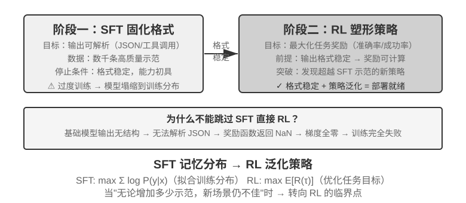

<!-- 自动生成；个人补充请写入 personal/。 -->

[全书目录](../../../README.md) · [上级目录](../README.md) · [上一篇：SFT 数据合成：从示范到可训练轨迹](../06-SFT%E6%95%B0%E6%8D%AE%E5%90%88%E6%88%90%EF%BC%9A%E4%BB%8E%E7%A4%BA%E8%8C%83%E5%88%B0%E5%8F%AF%E8%AE%AD%E7%BB%83%E8%BD%A8%E8%BF%B9/README.md) · [下一篇：单轮强化学习：记忆与泛化的对照](../08-%E5%8D%95%E8%BD%AE%E5%BC%BA%E5%8C%96%E5%AD%A6%E4%B9%A0%EF%BC%9A%E8%AE%B0%E5%BF%86%E4%B8%8E%E6%B3%9B%E5%8C%96%E7%9A%84%E5%AF%B9%E7%85%A7/README.md)

> 所属章节：[第8章：模型后训练](../README.md)
>
> 来源：[原文及行号](https://github.com/bojieli/ai-agent-book/blob/d1502f59c1a8c40b4d1c51c250238cd9dd836f1b/book/chapter8.md#L386-L409) · [在线原书](https://bojieli.github.io/ai-agent-book/book/chapter8/)

<!-- 原文开始 -->

## 何时选择 Mid-training、SFT 与 RL

[“四阶段全景”一节](../01-%E4%BB%8E%E9%A2%84%E8%AE%AD%E7%BB%83%E5%88%B0RL%EF%BC%9A%E5%9B%9B%E9%98%B6%E6%AE%B5%E5%85%A8%E6%99%AF/README.md#%E4%BB%8E%E9%A2%84%E8%AE%AD%E7%BB%83%E5%88%B0-rl%E5%9B%9B%E9%98%B6%E6%AE%B5%E5%85%A8%E6%99%AF)讲清了三种训练的机制，这一节给出实操诊断：**先判断缺的是底座、协议，还是策略，不要把“模型做不好”统一归因成需要 RL。**

表8-4 Mid-training、SFT 与 RL 的选择准则

| 观察到的现象 | 主要缺口 | 优先方法 | 进入下一阶段的门槛 |
| --- | --- | --- | --- |
| 领域概念、语言或基础操作不会；合理采样下 `pass@k` 仍接近 0 | 知识与能力不在基模的有效支持中 | **Mid-training**；动态事实则用 RAG | 领域留出集改善，通用保留集可接受，目标任务开始出现可验证的正确或部分正确轨迹 |
| 偶尔能做对，但格式、工具 schema、语气或固定流程不稳定 | 行为协议没有固化 | **SFT** 或约束解码 | 解析成功率稳定，关键动作和输出协议可被验证器可靠评分 |
| 已有非零成功率和可靠奖励，但好策略概率低、长程决策或 OOD 泛化不足 | 概率质量分配与策略优化 | **RL** | 奖励与真实目标一致；rollout 组内有足够奖励差异；独立测试集随训练改善 |
| 只有少量稳定示范，尚无可交互环境 | 可模仿数据有、在线反馈无 | **SFT/RFT/离线偏好优化** | 先建立基线与评估，再判断是否值得建设 RL 环境 |

实际决策可以按以下顺序进行：

1. **先排除不需要改权重的方案。** Prompt、工具、代码约束、上下文管理能解决行为问题时不必训练；事实需要频繁更新、引用或删除时优先 RAG。
2. **在目标留出集上测能力支持。** 不只看贪心的 `pass@1`，还要在固定采样配置下看 `pass@k`、部分进展率、格式解析率，并人工审计失败原因。若 `pass@k` 仍近零且失败集中在知识/基础能力，先做 Mid-training，重新评估后再决定后续步骤。
3. **用 SFT 立协议，不拿它硬塞知识库。** 当模型“会做但不会按要求做”时，用高质量示范固化 JSON schema、工具调用、术语用法、流程和风格。少量事实可以随示范学入参数，但大量事实知识不应让少数 QA 对承担。
4. **只在有探索空间时上 RL。** 当前策略已经能产生可评分、偶尔成功的 rollout，奖励又能忠实反映部署目标时，RL 才适合把低概率成功策略推高、探索示范外路径。`pass@k` 近零时先补 Mid-training/SFT 或设计可达的课程与部分奖励；全零 rollout 上直接加 PPO/GRPO 通常只会消耗采样预算。

这个流程不是要求每个项目都依次跑完三种训练。强基模可能直接进入 RL，格式型任务可能只需 SFT，稳定领域知识可能只做 Mid-training 后再复用原有对齐能力。关键是每一步都有可测的进入条件，而不是把 “Mid-training → SFT → RL” 当作仪式化流水线。

<!-- 原文结束 -->

---

[全书目录](../../../README.md) · [上级目录](../README.md) · [上一篇：SFT 数据合成：从示范到可训练轨迹](../06-SFT%E6%95%B0%E6%8D%AE%E5%90%88%E6%88%90%EF%BC%9A%E4%BB%8E%E7%A4%BA%E8%8C%83%E5%88%B0%E5%8F%AF%E8%AE%AD%E7%BB%83%E8%BD%A8%E8%BF%B9/README.md) · [下一篇：单轮强化学习：记忆与泛化的对照](../08-%E5%8D%95%E8%BD%AE%E5%BC%BA%E5%8C%96%E5%AD%A6%E4%B9%A0%EF%BC%9A%E8%AE%B0%E5%BF%86%E4%B8%8E%E6%B3%9B%E5%8C%96%E7%9A%84%E5%AF%B9%E7%85%A7/README.md)
