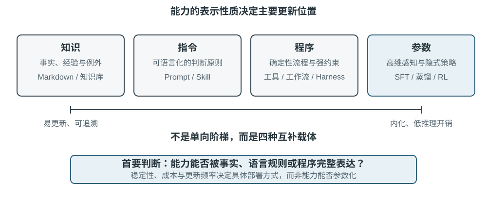

<!-- 自动生成；个人补充请写入 personal/。 -->

[全书目录](../../../README.md) · [上级目录](../README.md) · [上一篇：从运行轨迹中获得学习信号](../01-%E4%BB%8E%E8%BF%90%E8%A1%8C%E8%BD%A8%E8%BF%B9%E4%B8%AD%E8%8E%B7%E5%BE%97%E5%AD%A6%E4%B9%A0%E4%BF%A1%E5%8F%B7/README.md) · [下一篇：将经验沉淀为知识](01-%E5%B0%86%E7%BB%8F%E9%AA%8C%E6%B2%89%E6%B7%80%E4%B8%BA%E7%9F%A5%E8%AF%86.md)

> 所属章节：[第9章：Agent 的持续进化](../README.md)
>
> 来源：[原文及行号](https://github.com/bojieli/ai-agent-book/blob/d1502f59c1a8c40b4d1c51c250238cd9dd836f1b/book/chapter9.md#L56-L74) · [在线原书](https://bojieli.github.io/ai-agent-book/book/chapter9/)

<!-- 原文开始 -->

## Agent 持续进化的四种方法

学习信号说明 Agent 应当改变，但没有说明改变应发生在哪里。事实和经验适合写成知识文档；可以用语言清楚表达的策略适合写入提示词或 Skill；可以精确执行的流程与约束适合写成程序；感知、语言风格和隐式策略等高维能力则必须进入模型参数。图9-3展示了这四种方式及其关系。

表9-2给出了一个紧凑的比较。四种方式并不互斥：医疗影像 Agent 依靠参数识别病灶，用知识库提供最新指南，再用代码计算风险指标；客服模型的自然语气来自后训练，具体企业政策由知识和 Skill 提供，关键合规则由服务端代码兜底。

表9-2 四种持续进化方式的适用边界

| 更新方式 | 适合承载 | 主要优势 | 主要局限 |
|---|---|---|---|
| 经验知识库 | 事实、经验规律、例外与来源 | 更新快、可追溯、可按需检索 | 依赖检索和模型正确应用 |
| Prompt 与 Skill | 需要理解语境、例外和优先级，但仍能用自然语言说明的判断原则 | 可解释、作用范围可控 | 容易膨胀、冲突或被忽略 |
| 程序与 Harness | 可确定解析、可执行验证和高风险硬约束 | 可测试、执行稳定、成本低 | 开发与维护成本较高 |
| 模型参数 | 高维感知、生成风格和隐式策略 | 泛化能力强、推理开销低 | 更新与回归成本高 |

同一能力可以拆到多个载体：事实进入知识库，解释例外的原则进入 Skill，不可绕过的权限仍由程序门控，高维识别能力再进入参数。路由结果只是更新提案，尚未获得发布资格。

<!-- 原文结束 -->

## 阅读目录

- [将经验沉淀为知识](01-%E5%B0%86%E7%BB%8F%E9%AA%8C%E6%B2%89%E6%B7%80%E4%B8%BA%E7%9F%A5%E8%AF%86.md)
- [将经验写成指令](02-%E5%B0%86%E7%BB%8F%E9%AA%8C%E5%86%99%E6%88%90%E6%8C%87%E4%BB%A4.md)
- [将经验写成程序](03-%E5%B0%86%E7%BB%8F%E9%AA%8C%E5%86%99%E6%88%90%E7%A8%8B%E5%BA%8F.md)
- [将经验写入参数](04-%E5%B0%86%E7%BB%8F%E9%AA%8C%E5%86%99%E5%85%A5%E5%8F%82%E6%95%B0.md)
- [从更新产物到更新“更新方法”](05-%E4%BB%8E%E6%9B%B4%E6%96%B0%E4%BA%A7%E7%89%A9%E5%88%B0%E6%9B%B4%E6%96%B0%E2%80%9C%E6%9B%B4%E6%96%B0%E6%96%B9%E6%B3%95%E2%80%9D.md)

---

[全书目录](../../../README.md) · [上级目录](../README.md) · [上一篇：从运行轨迹中获得学习信号](../01-%E4%BB%8E%E8%BF%90%E8%A1%8C%E8%BD%A8%E8%BF%B9%E4%B8%AD%E8%8E%B7%E5%BE%97%E5%AD%A6%E4%B9%A0%E4%BF%A1%E5%8F%B7/README.md) · [下一篇：将经验沉淀为知识](01-%E5%B0%86%E7%BB%8F%E9%AA%8C%E6%B2%89%E6%B7%80%E4%B8%BA%E7%9F%A5%E8%AF%86.md)
