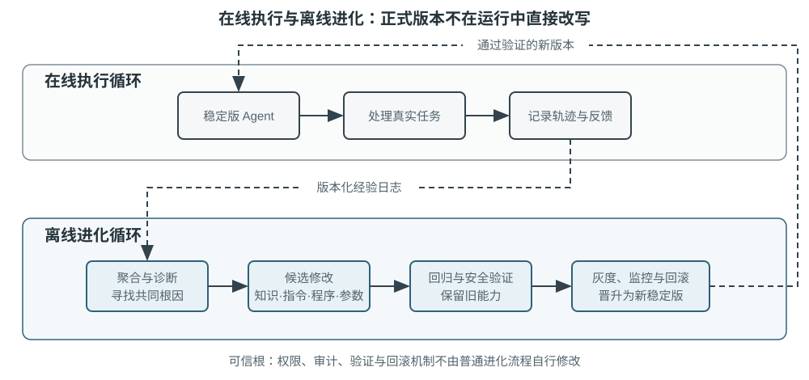

<!-- 自动生成；个人补充请写入 personal/。 -->

[全书目录](../../../README.md) · [上级目录](../README.md) · [上一篇：从更新产物到更新“更新方法”](../02-Agent%E6%8C%81%E7%BB%AD%E8%BF%9B%E5%8C%96%E7%9A%84%E5%9B%9B%E7%A7%8D%E6%96%B9%E6%B3%95/05-%E4%BB%8E%E6%9B%B4%E6%96%B0%E4%BA%A7%E7%89%A9%E5%88%B0%E6%9B%B4%E6%96%B0%E2%80%9C%E6%9B%B4%E6%96%B0%E6%96%B9%E6%B3%95%E2%80%9D.md) · [下一篇：可验证闭环的边界：当“完成”不等于“进步”](01-%E5%8F%AF%E9%AA%8C%E8%AF%81%E9%97%AD%E7%8E%AF%E7%9A%84%E8%BE%B9%E7%95%8C%EF%BC%9A%E5%BD%93%E2%80%9C%E5%AE%8C%E6%88%90%E2%80%9D%E4%B8%8D%E7%AD%89%E4%BA%8E%E2%80%9C%E8%BF%9B%E6%AD%A5%E2%80%9D.md)

> 所属章节：[第9章：Agent 的持续进化](../README.md)
>
> 来源：[原文及行号](https://github.com/bojieli/ai-agent-book/blob/d1502f59c1a8c40b4d1c51c250238cd9dd836f1b/book/chapter9.md#L274-L316) · [在线原书](https://bojieli.github.io/ai-agent-book/book/chapter9/)

<!-- 原文开始 -->

## 构建可长期运行的持续进化闭环

四种更新方式只有进入同一个自主循环，才会从单次优化变成持续进化。图9-5展示了生产系统中更稳妥的双循环结构：在线执行循环只完成任务并记录证据，不直接改写正式 Agent；离线进化循环聚合轨迹、诊断根因、生成更新提案，再通过验证门槛发布新版本。两者通过版本化的经验库和评估集连接。

Voyager[^voyager-2023] 展示了一个较完整的持续进化循环。它在 Minecraft 中根据当前能力选择新目标，通过环境反馈迭代程序，验证成功后把代码存入技能库，再组合旧技能解决更难任务。自动课程、可执行技能和环境验证缺一不可：只有技能库而没有课程，Agent 不知道下一步学什么；只有自我反思而没有环境验证，技能库会积累错误；只有探索而没有持久化，每次任务仍要从头开始。现实 Agent 的知识、Prompt、工具和参数虽然更复杂，基本学习过程是类似的。

具体来说，Voyager 由三个互相咬合的机制组成。**自动课程生成器**根据当前物品、环境和已掌握技能提出下一个难度适中的目标，使探索不是随机漫游；**技能库**把成功程序保存为可检索、可组合的代码，例如高级采集技能可以调用移动和制作等基础技能；**迭代提示机制**把环境观察、执行错误和自验证结果带回下一轮代码生成，直到任务真正通过。

**发现循环：假设、实验、评估、反馈**。以 Voyager 为代表的 Agent 自我进化系统正是遵循了由假设、实验、评估和反馈组成的发现循环，这也是数百年来逐渐形成的科学方法。最近，Jeff Dean 等人创办的 Discovery Loop 提出将发现循环推向自动化：提出实验、实现实验、开展评估、取得结果，再把结果交给下一轮[^ch1-discovery-loop]。这本质上就是 Agent 自我进化在科学领域的应用。本章所述的 Agent 自我进化要想避免自说自话、自我感觉良好，就必须遵循科学方法。

[^ch1-discovery-loop]: Discovery Loop 由 Jeff Dean、Sanjay Ghemawat、Quoc Le 和 Oriol Vinyals 于 2026 年 8 月 5 日宣布创立，是一家公益公司，其公开表述是自动化完整的实验循环、把原本串行的实验大规模并行化。

在 Agent 持续进化中，要区分两种经常混在一起的能力。**Harness 更新能力**（harness-updating）是从轨迹中产生有价值的持久修改；**Harness 受益能力**（harness-benefit）是任务 Agent 在后续运行中找到、激活并正确使用这些修改。一个 Skill 本身可能写得完全正确，但较弱的任务模型没有在合适场景加载它，或加载后无法长期遵循，其中任一种都会让最终成绩看起来 “没有进化”。因此，不能只用端到端分数反推更新器好坏。Lin 等人的模型替换实验表明，这两种能力与基础模型能力的关系并不相同[^harness-benefit-2026]。

表9-3 持续进化的分层评估指标

| 指标      | 回答的问题                            | 主要证据            |
| ------- | -------------------------------- | --------------- |
| 更新提案有效率 | 更新器是否提出了有价值的修改                   | 提案在独立验证中的接受率与增益 |
| 产物激活率   | 任务 Agent 是否在正确场景加载了新 Skill、记忆或工具 | 检索、路由与工具调用轨迹    |
| 遵循成功率   | 激活后是否按新规则或流程执行                   | 动作序列与过程验证器      |
| 保留任务集增益 | 整体是否改善了未参与进化的任务，是否有泛化能力          | 保留集成功率、质量与成本    |

评估不是学习结束后集中进行的考试，而是自我进化过程中不可或缺的一部分。长期评价至少同时观察五类结果：

- 回退（regression），即新经验是否与已有的其他经验冲突，原本能通过的案例是否出现回退；
- 泛化能力，即新经验在测试集尚未覆盖的场景中带来的效果提升；
- Token 效率，即完成任务消耗的 Token 成本；
- 安全性，即规则、隐私和拒绝边界是否随进化漂移；
- 长期工程质量，即维护复杂度、架构一致性、所有权边界、向后兼容性以及未来迁移和调试负担是否恶化。

只解决了当前失败案例的问题，却在其他已有案例或新领域中退化，不是成功的持续进化。

> **实验 9-9 ★★★：评估 Agent 是否在持续进化**
>
> **实验目的**：区分“保存反馈”“不断追加反馈”和“能够更新、迁移并保留能力”三种行为，验证 Agent 是否真的在持续进化。
>
> **实验说明**：让 Agent 先在一组任务中获得反馈，再面对表述变化、规则更新和原有能力保持等情况。对照静态记忆、只追加记忆和可替换/可淘汰的版本化记忆，观察经验能否迁移，也观察新规则是否覆盖旧规则、更新后是否遗忘。
>
> **实验说明了什么**：持续进化至少包含四个环节——记住、迁移、更新和保持。最终分数高并不够；若系统继续使用已废止规则、靠违规捷径完成任务，或更新后破坏原有能力，都不能判定为持续进化。

<!-- 原文结束 -->

## 阅读目录

- [可验证闭环的边界：当“完成”不等于“进步”](01-%E5%8F%AF%E9%AA%8C%E8%AF%81%E9%97%AD%E7%8E%AF%E7%9A%84%E8%BE%B9%E7%95%8C%EF%BC%9A%E5%BD%93%E2%80%9C%E5%AE%8C%E6%88%90%E2%80%9D%E4%B8%8D%E7%AD%89%E4%BA%8E%E2%80%9C%E8%BF%9B%E6%AD%A5%E2%80%9D.md)
- [持续进化的安全边界](02-%E6%8C%81%E7%BB%AD%E8%BF%9B%E5%8C%96%E7%9A%84%E5%AE%89%E5%85%A8%E8%BE%B9%E7%95%8C.md)
- [睡眠学习：整合、遗忘与能力保鲜](03-%E7%9D%A1%E7%9C%A0%E5%AD%A6%E4%B9%A0%EF%BC%9A%E6%95%B4%E5%90%88%E3%80%81%E9%81%97%E5%BF%98%E4%B8%8E%E8%83%BD%E5%8A%9B%E4%BF%9D%E9%B2%9C.md)

<!-- 补齐本页引用的原文定义 -->

[^voyager-2023]: Wang, G., et al. *Voyager: An Open-Ended Embodied Agent with Large Language Models.* arXiv:2305.16291, 2023.

[^harness-benefit-2026]: Lin, Minhua, et al. *Harness Updating Is Not Harness Benefit: Disentangling Evolution Capabilities in Self-Evolving LLM Agents.* arXiv:2605.30621, 2026.

---

[全书目录](../../../README.md) · [上级目录](../README.md) · [上一篇：从更新产物到更新“更新方法”](../02-Agent%E6%8C%81%E7%BB%AD%E8%BF%9B%E5%8C%96%E7%9A%84%E5%9B%9B%E7%A7%8D%E6%96%B9%E6%B3%95/05-%E4%BB%8E%E6%9B%B4%E6%96%B0%E4%BA%A7%E7%89%A9%E5%88%B0%E6%9B%B4%E6%96%B0%E2%80%9C%E6%9B%B4%E6%96%B0%E6%96%B9%E6%B3%95%E2%80%9D.md) · [下一篇：可验证闭环的边界：当“完成”不等于“进步”](01-%E5%8F%AF%E9%AA%8C%E8%AF%81%E9%97%AD%E7%8E%AF%E7%9A%84%E8%BE%B9%E7%95%8C%EF%BC%9A%E5%BD%93%E2%80%9C%E5%AE%8C%E6%88%90%E2%80%9D%E4%B8%8D%E7%AD%89%E4%BA%8E%E2%80%9C%E8%BF%9B%E6%AD%A5%E2%80%9D.md)
