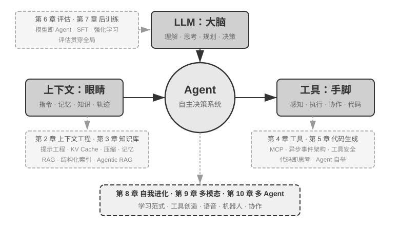

<!-- 自动生成；个人补充请写入 personal/。 -->

[全书目录](../../README.md) · [上级目录](../../README.md) · [下一篇：全书结构](01-%E5%85%A8%E4%B9%A6%E7%BB%93%E6%9E%84/README.md)

> 所属章节：[引言](README.md)
>
> 来源：[原文及行号](https://github.com/bojieli/ai-agent-book/blob/d1502f59c1a8c40b4d1c51c250238cd9dd836f1b/book/introduction.md#L1-L36) · [在线原书](https://bojieli.github.io/ai-agent-book/book/introduction/)

<!-- 原文开始 -->

# 引言

2025 年 8 月至 10 月，我在图灵《AI Agent 实战营》中讲授了一系列课程。课程围绕一个核心问题展开：如何以可解释、可验证、可复用的工程原则设计 AI Agent，而不是依赖经验和直觉反复试错？因此，课程不以跑通一个演示系统为终点，而是进一步分析 Agent 为何采用特定架构，以及每项设计决策对应的能力边界与工程取舍。本书以课程讲义和配套实验为基础，经过系统整理、补充与重构而成。

本书的形成过程本身也是一次人机协作实践。从最初构思到书稿定型，我主要采用 **whisper coding**（口述式协作）的方式，与 Pine 的语音 Agent 共同完成资料整理和文本迭代。准备课程时，我先口述章节提纲，由 Agent 调研相关工作并形成材料草稿；课程结束后，再结合学员反馈，对论证、案例和实验反复核查与修订。语音降低了将想法外化为文本的成本，也缩短了“提出问题—检索资料—形成草稿—复核修改”的迭代周期。因而，这本书不仅讨论 Agent，也记录了一种由 Agent 深度参与的知识生产方式。

自 2025 年初 DeepSeek R1 发布以来，AI 研究与产业实践的重心逐步从基座模型能力扩展到 Agent 的系统化落地。在模型侧，智能体强化学习（Agentic Reinforcement Learning）开始将工具调用及环境交互能力内化到模型参数中，使模型在编程（coding）、数学推理和图形界面操作（computer use）等领域表现出更强的通用能力。在产品侧，Manus、Claude Code、OpenClaw 等通用 Agent 则推动了人机交互方式的变化，并使“代码生成 + 文件系统”成为重要的系统架构范式。

重新审视课程中总结的 Agent 架构原则，可以发现：尽管模型和产品快速迭代，这些原则仍然具有稳定的解释力。业界后来广泛使用 Skill、harness、loop engineering 等术语，但相应的工程实践往往更早出现；概念的形成，是对大量实践经验的归纳，而不是实践的起点。换言之，实践在前，命名在后。

这些原则主要来自长流程、高风险场景中的工程实践。作为 Pine AI 的首席科学家，我与团队共同研发了 Pine，使 Agent 能够代表用户与真人沟通，并处理账单协商、退款投诉和订阅取消等涉及真实经济利益的复杂任务。这类任务通常跨越较长时间、包含多轮交涉，且单个步骤的错误就可能造成实际损失。对可靠性、安全性和可审计性的严格要求，促使我们逐步形成了本书所强调的架构原则。下面几个例子均来自这段实践。

- 早在 Skill 概念流行之前，我们就已经采用动态加载提示词的方法解决提示词无限膨胀的问题，采用命令行执行工具的方式解决工具列表无限膨胀的问题，采用系统状态栏技术解决 Agent 不感知执行环境和用户时间、工作状态等问题。
- 早在 harness 概念流行之前，我们就已经采用类似 Claude Code 的方法，解决模型工具调用不稳定、产生幻觉、执行危险或越权操作、不遵循指令等问题。
- 早在 loop engineering 概念流行之前，我们就在使用本书称为提议者-审核者（proposer-reviewer）的方法解决模型过早认为任务完成的问题。

这些方法并非 Pine 所独有。许多模型与 Agent 团队在解决相似问题时，都独立形成了相近的工程方法；这种趋同说明，它们反映的是 Agent 系统的共性约束。基于这些认识，我于 2025 年在图灵开设《AI Agent 实战营》，并于 2024—2026 年持续在中国科学院大学讲授 AI Agent 实践课程。本书选择开源发布，也希望让这些可复用的知识和经验服务于更多研究者与工程实践者。

**实践在前，命名在后**。对企业级 Agent 开发而言，这意味着实践不能始终滞后于概念的普及：当一个术语成为行业共识时，其对应的问题往往已经在领先系统中经过了长期探索。要更早识别并解决这些问题，我认为有两个关键条件。

**第一，选择对 Agent 能力上限提出足够高要求的真实业务，并持续获取真实反馈。** 以 Pine 为例，一项任务可能持续数小时乃至数周，期间需要与多个利益相关方反复沟通，完成长时间通话、复杂表单操作和多轮邮件往来；同时还必须保证关键数字准确、操作可控，并始终维护用户利益。足够复杂的场景会持续暴露模型能力与业务要求之间的差距，从而促使团队构建 harness，系统解决模型暂时无法独立处理、业务却必须完成的问题。如果业务需求很容易被下一次模型升级覆盖，团队也较难积累稳定的系统设计原则。

**第二，建立系统的评估（Evaluation）机制。** 没有评估，就无法判断一次改动带来的提升究竟源于设计本身，还是仅仅来自随机波动。评估把 Agent 的迭代从经验判断转化为可比较、可复现的工程过程，是以科学方法开展系统开发的基础。第七章将专门讨论这套方法。

不管底层模型如何升级，不管产品形态如何创新，几乎所有成功的 Agent 系统都遵循着相同的架构模式。这并非巧合：**好的设计原则本就应该穿越模型的迭代周期**，因为它们描述的不是某个模型的用法，而是智能系统与世界交互的基本模式。

图灵奖得主、强化学习之父 Richard Sutton 曾说，宇宙演化经历了从尘埃到恒星、从恒星到生命、从生命到智能体（原文为设计实体，designed entities）的 4 个阶段。生物进化是盲目的：随机变异，自然选择。大多数生物并不理解自身的运作原理，也无法自主设计和改造自己。而智能体（Agent）是宇宙演化史上一种全新的存在：它能通过生成代码实现自举（bootstrap）和自我进化，就像一个程序员编写了另一个程序员，然后新的程序员又能继续编写下一个。也就是说，Agent 能够理解自身的运作机制，并根据目标创造全新的智能体，甚至改进自己。本书的使命，就是帮助你理解和掌握这种创造的原则。

本书的核心公式只有一句话：**Agent = LLM + 上下文 + 工具**。三者缺一不可。

更直观地说，就是**大脑 + 眼睛 + 手脚**。大脑（LLM）负责思考和决策，眼睛（上下文）决定 Agent 能看到什么信息，手脚（工具）决定 Agent 能做什么事情。（严格来说，“眼睛”只是一个粗略的类比：上下文不仅包含环境信息和对话历史，还包含工具定义等内容，也就是说 Agent “看到”的信息中也包括了“有哪些手脚可用”。这个隐喻旨在传达核心直觉：上下文是模型能感知到的一切信息。）

对熟悉强化学习的读者，这三者也可以映射到 RL 的形式化语言。具体来说，LLM 对应 Policy（策略），上下文对应 Observation Space（观察空间），工具对应 Action Space（动作空间）。三种说法对应同一个对象，只是表达层次不同。

<!-- 原文结束 -->

## 阅读目录

- [全书结构](01-%E5%85%A8%E4%B9%A6%E7%BB%93%E6%9E%84/README.md)
- [如何阅读本书](02-%E5%A6%82%E4%BD%95%E9%98%85%E8%AF%BB%E6%9C%AC%E4%B9%A6/README.md)
- [前置知识](03-%E5%89%8D%E7%BD%AE%E7%9F%A5%E8%AF%86/README.md)
- [致谢](04-%E8%87%B4%E8%B0%A2/README.md)

---

[全书目录](../../README.md) · [上级目录](../../README.md) · [下一篇：全书结构](01-%E5%85%A8%E4%B9%A6%E7%BB%93%E6%9E%84/README.md)
